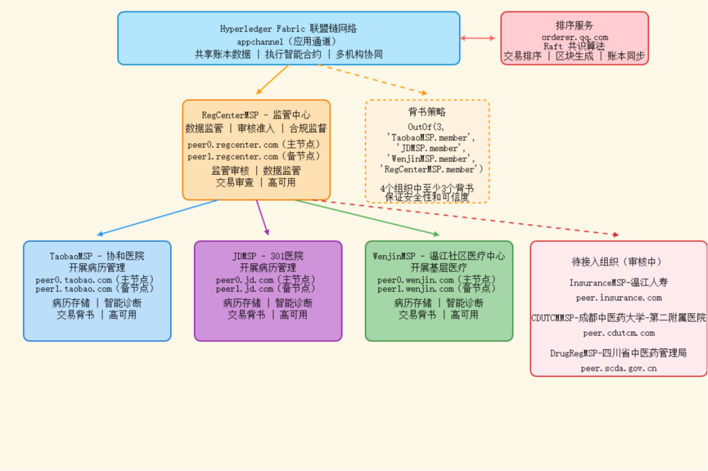
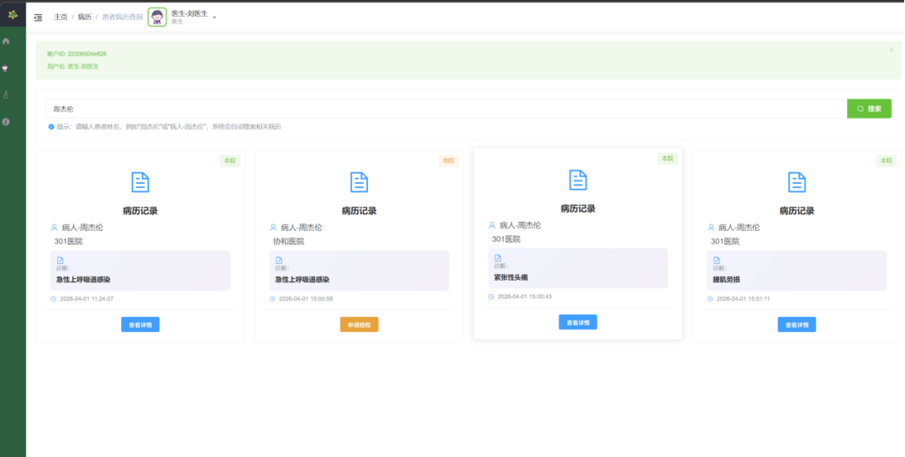
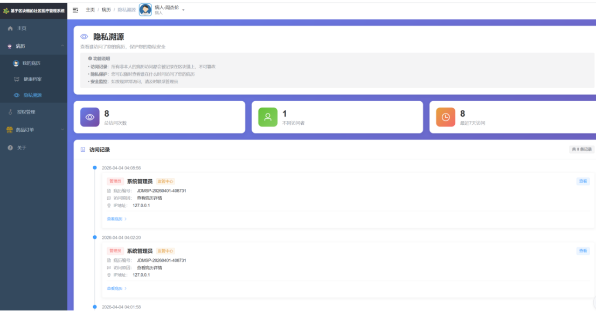

<div align="center">

# 🏥 基于区块链的社区医疗档案管理系统

### *Community Medical Record Management System Based on Hyperledger Fabric*


**打破医疗信息孤岛 · 患者数据自主可控 · 跨机构安全共享**

</div>

---

## 📋 项目概述

本项目是一个基于 **Hyperledger Fabric 联盟链** 的社区医疗档案管理系统，旨在解决传统医疗体系中长期存在的**数据孤岛、患者隐私泄露、跨机构病历共享难**等痛点。

通过区块链的**不可篡改、可追溯、去中心化**特性，实现患者医疗档案在多家医疗机构间的安全流转与授权访问。

### 🎯 核心价值

| 维度 | 传统模式 | 本系统 |
|------|---------|--------|
| 数据归属 | 医院持有，患者被动 | **患者自主授权，数据可携带** |
| 跨院共享 | 纸质/传真，数天甚至数周 | **链上秒级授权，即时访问** |
| 审计追溯 | 人工日志，查证困难 | **全链路上链，不可篡改** |
| 隐私保护 | 明文存储，泄露风险高 | **证书体系 + 通道隔离 + 细粒度权限** |

---

## 🏛️ 系统架构

### 联盟链网络拓扑



系统由 **4 个联盟组织 + 1 个排序服务节点** 组成：

| 组织 | 角色 | 节点 |
|------|------|------|
| **Taobao** 🏪 | 药房服务商 | peer0, peer1 |
| **JD** 🏥 | 互联网医疗平台 | peer0, peer1 |
| **Wenjin** 🏛️ | 温江社区医疗中心 | peer0, peer1 |
| **RegCenter** 🔍 | 监管审计中心 | peer0, peer1 |
| **Orderer (QQ.com)** ⚖️ | 共识排序节点 | orderer |

> 所有组织加入同一通道 `appchannel`，通过 Fabric 的 **多通道隔离 + 背书策略** 实现数据隐私保护。

### 核心业务流程





---

## 🛠️ 技术栈

### 区块链层
```
Hyperledger Fabric 1.4.12   →  联盟链底层框架
Go Chaincode                →  智能合约（业务逻辑上链）
Fabric SDK-Go               →  Go 语言客户端 SDK
Fabric CA                   →  证书与身份管理
```

### 后端服务层
```
Go 1.18 + Gin Framework     →  RESTful API 服务
GORM + MySQL 8.0            →  关系型数据持久化
Cron                        →  定时任务调度
```

### 前端展示层
```
Vue 2.6 + Element UI 2.13   →  后台管理界面
ECharts 5.4                 →  数据可视化图表
Axios                       →  HTTP 请求封装
```

---

## ✨ 核心功能

### 👤 用户管理
- 多角色体系：**患者、医生、药房、管理员、监管机构**
- 密码登录 + 区块链身份绑定
- 用户信息软删除（保留链上记录）

### 📋 病历管理
- 病历 **链上创建 + 链下存储** 混合架构
- 支持图文、诊断记录、处方等多类型病历
- 基于通道隔离的跨机构病历共享

### 🔐 授权管理
- **患者主动授权**：指定医生/机构查看病历
- 授权记录全部上链，**可追溯、不可抵赖**
- 支持**临时授权 + 长期授权**两种模式

### 💊 药品订单
- 医生开方 → 患者下单 → 药房配药 → 配送完成
- 订单状态在链上完整流转
- 每个状态变更均有背书节点签名验证

### 🏦 保险报销
- 保险覆盖信息管理
- 理赔申请自动关联链上病历
- 减少人工审核环节

### 📊 联盟监控
- **链上活动实时监控**（交易量、区块高度、节点状态）
- 病历访问轨迹可视化
- 审计日志完整可查

---

## 🚀 快速启动

### 前置条件

| 组件 | 版本要求 |
|------|---------|
| Docker & Docker Compose | ≥ 19.03 |
| Go | ≥ 1.18 |
| Node.js | ≥ 12.x |
| MySQL | ≥ 8.0 |

### 1️⃣ 启动 Fabric 区块链网络

```bash
cd network
# 生成证书与创世区块（首次执行）
./start.sh
```

### 2️⃣ 安装链码到所有 Peer 节点

```bash
./install-all-peers.sh
```

### 3️⃣ 启动后端 API 服务

```bash
cd application/server
# 修改 config.yaml 中的数据库连接信息
go run main.go
```

API 服务默认监听 `:8080` 端口。

### 4️⃣ 启动前端管理界面

```bash
cd application/web
npm install
npm run dev
```

访问 `http://localhost:9527` 进入系统。

### 🐳 Docker 一键部署

```bash
docker-compose up -d
```

---

## 📁 项目目录结构

```
fabric-medical-system/
│
├── application/                  # 🔧 应用层
│   ├── server/                   #   Go 后端服务
│   │   ├── api/                  #     API 接口层
│   │   │   └── v2/               #       v2 版本接口
│   │   ├── blockchain/           #     Fabric SDK 封装
│   │   ├── db/                   #     数据库初始化 & 迁移
│   │   ├── model/                #     数据模型定义
│   │   ├── pkg/                  #     工具包
│   │   │   ├── app/              #       响应封装
│   │   │   ├── cache/            #       缓存层
│   │   │   └── cron/             #       定时任务
│   │   ├── routers/              #     路由注册
│   │   ├── service/              #     业务逻辑层
│   │   ├── config.yaml           #     Fabric SDK 配置
│   │   └── main.go               #     入口文件
│   │
│   └── web/                      # 🎨 Vue 前端
│       └── src/
│           ├── api/              #     前端 API 封装
│           ├── views/            #     页面组件
│           ├── router/           #     前端路由
│           └── store/            #     Vuex 状态管理
│
├── chaincode/                    # ⛓️ Fabric 链码（智能合约）
│   ├── api/                      #   链码业务接口
│   │   ├── account.go            #     账户管理
│   │   ├── access.go             #     访问控制
│   │   ├── doctor.go             #     医生管理
│   │   ├── drug.go               #     药品订单
│   │   ├── insurance.go          #     保险报销
│   │   └── supplement.go         #     补充记录
│   ├── model/                    #   链码数据模型
│   ├── pkg/utils/                #   链码工具函数
│   └── chaincode.go              #   链码入口
│
├── network/                      # 🌐 Fabric 网络配置
│   ├── configtx.yaml             #   通道 & 锚节点配置
│   ├── crypto-config.yaml        #   证书拓扑定义
│   ├── docker-compose.yaml       #   容器编排（4组织 + 排序节点）
│   ├── docker-compose-base.yaml  #   基础容器配置
│   ├── start.sh / stop.sh        #   网络启停脚本
│   └── explorer/                 #   区块链浏览器
│       ├── docker-compose.yaml   #     Explorer 容器
│       └── connection-profile/   #     连接配置文件
│
├── scripts/                      # 📜 部署 & 辅助脚本
├── tests/                        # 🧪 测试
│   └── jmeter/                   #     JMeter 性能测试脚本
│
├── 图/                           # 📊 系统架构图
├── .gitignore
├── docker-compose.yml            # 🐳 应用层容器编排
└── README.md
```

---

## 🔌 API 概览 (v2)

| 分类 | 接口 | 说明 |
|------|------|------|
| 🔑 **认证** | `POST /api/v2/register` | 用户注册（同时创建链上身份） |
| | `POST /api/v2/loginWithPassword` | 密码登录 |
| 👤 **用户** | `POST /api/v2/getUserInfo` | 获取用户信息 |
| | `POST /api/v2/updateUser` | 更新用户资料 |
| | `POST /api/v2/deleteUser` | 软删除用户 |
| | `POST /api/v2/restoreUser` | 恢复已删除用户 |
| 📋 **病历** | `POST /api/v2/createPrescription` | 创建病历记录 |
| | `POST /api/v2/queryPrescription` | 查询病历列表 |
| 🔐 **授权** | `POST /api/v2/requestAccess` | 申请病历访问权限 |
| | `POST /api/v2/approveAccess` | 审批访问请求 |
| | `POST /api/v2/queryAccessTrace` | 查询访问轨迹 |
| 💊 **药品** | `POST /api/v2/createDrugOrder` | 创建药品订单 |
| | `POST /api/v2/queryDrugOrderList` | 查询药品订单列表 |
| 🏦 **保险** | `POST /api/v2/createInsuranceCover` | 创建保险报销信息 |
| | `POST /api/v2/queryInsuranceCoverList` | 查询保险信息 |
| 📊 **监控** | `POST /api/v2/queryBlockchainInfo` | 查询区块链状态 |
| | `POST /api/v2/queryChaincodeList` | 查询已安装链码 |

> 完整接口定义见 `application/server/routers/router.go`

---

## 🔐 安全设计

- **身份认证**：Fabric CA 证书体系 + JWT 双重认证
- **数据隔离**：通道（Channel）隔离不同业务数据
- **访问控制**：基于背书策略（Endorsement Policy）的细粒度权限
- **隐私保护**：私有数据集合（Private Data Collection）保护敏感字段
- **审计追溯**：所有操作上链，不可篡改

---

## 📈 性能指标

| 指标 | 数据 |
|------|------|
| 共识节点 | 1 个排序节点（可扩展至 Raft 集群） |
| 组织节点 | 4 个组织，共 8 个 Peer 节点 |
| 通道 | 1 个应用通道 |
| 链码语言 | Go |
| 数据库 | CouchDB（支持富查询） |

---

## 🧪 测试

```bash
# 运行链码单元测试
cd chaincode
go test -v

# 运行后端单元测试
cd application/server
go test -v ./...

# JMeter 性能测试
cd tests/jmeter
# 导入 medical-system-performance.jmx 到 JMeter 运行
```

---

## 📄 License

[MIT License](LICENSE)

---

<div align="center">

**⭐ 如果这个项目对你有帮助，欢迎 Star！**

</div>
