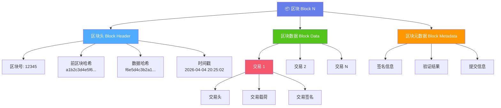
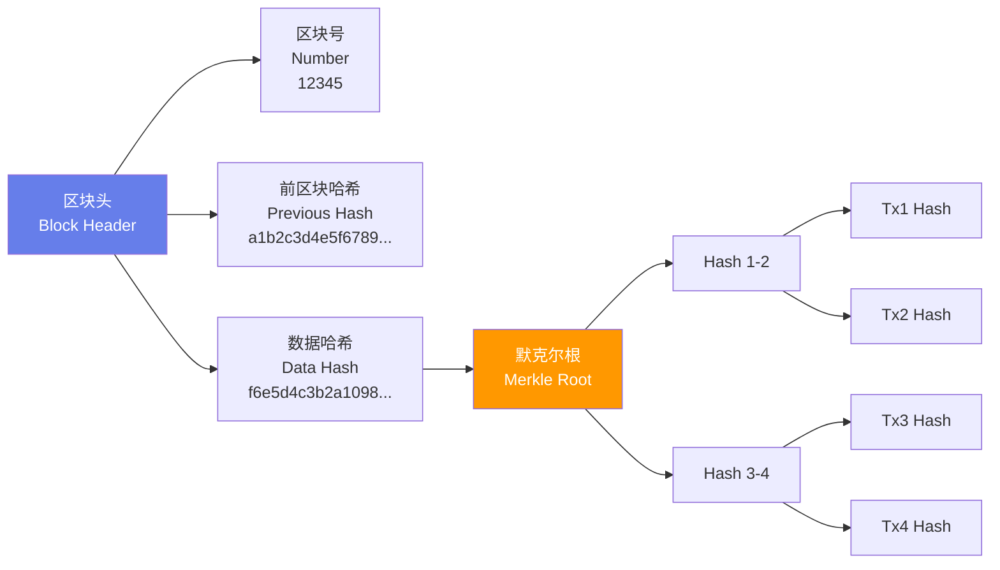
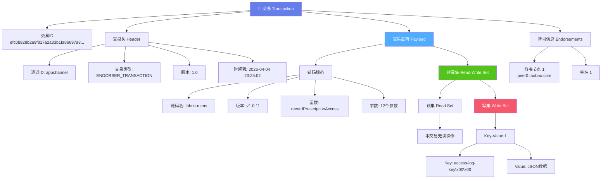
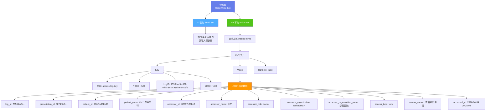
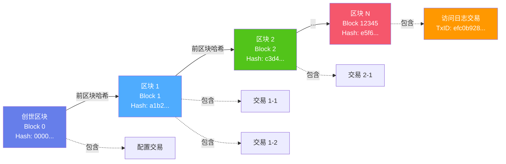
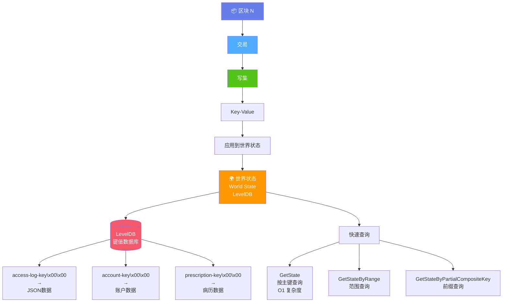
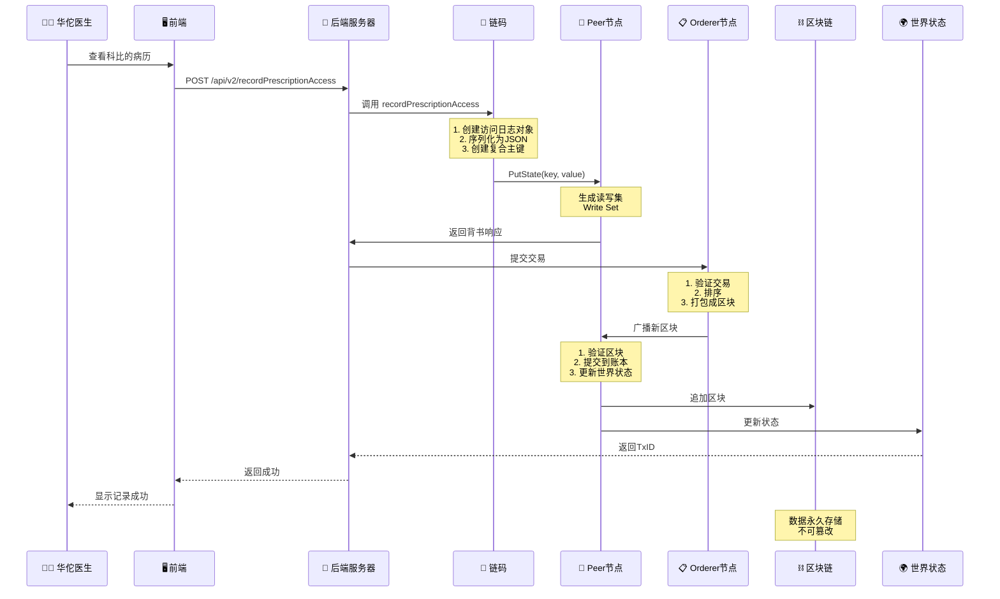

# Hyperledger Fabric 区块结构详细图

## 实例：华佗访问科比病历的访问日志

交易ID: `efc0b928b2e9f817a2a33b1fa86697a34180dd21a0f24ad31ba1c337258a950d`

---

## 1. 完整区块结构



---

## 2. 区块头详细结构



---

## 3. 交易详细结构



---

## 4. 读写集详细结构



---

## 5. 区块链哈希链结构



---

## 6. 区块到世界状态的映射



---

## 7. 完整数据流程



---

## 8. 区块内部字节结构

```
┌─────────────────────────────────────────────────────────────────┐
│                         区块 (Block)                             │
├─────────────────────────────────────────────────────────────────┤
│                                                                   │
│  ┌───────────────────────────────────────────────────────────┐  │
│  │ 区块头 (Block Header) - 约 100 字节                       │  │
│  ├───────────────────────────────────────────────────────────┤  │
│  │ • Number (8 bytes): 0x00 0x00 0x00 0x00 0x00 0x00 0x30 0x39│  │
│  │   → 12345                                                  │  │
│  │                                                             │  │
│  │ • PreviousHash (32 bytes):                                 │  │
│  │   a1 b2 c3 d4 e5 f6 78 9a bc de f0 12 34 56 78 9a ...     │  │
│  │                                                             │  │
│  │ • DataHash (32 bytes):                                     │  │
│  │   f6 e5 d4 c3 b2 a1 09 8f ed cb a9 87 65 43 21 0f ...     │  │
│  └───────────────────────────────────────────────────────────┘  │
│                                                                   │
│  ┌───────────────────────────────────────────────────────────┐  │
│  │ 区块数据 (Block Data) - 可变大小                          │  │
│  ├───────────────────────────────────────────────────────────┤  │
│  │                                                             │  │
│  │  ┌─────────────────────────────────────────────────────┐  │  │
│  │  │ 交易 1 (Transaction 1) - 约 2KB                     │  │  │
│  │  ├─────────────────────────────────────────────────────┤  │  │
│  │  │ • TxID (32 bytes):                                   │  │  │
│  │  │   ef c0 b9 28 b2 e9 f8 17 a2 a3 3b 1f a8 66 97 a3 │  │  │
│  │  │   41 80 dd 21 a0 f2 4a d3 1b a1 c3 37 25 8a 95 0d │  │  │
│  │  │                                                      │  │  │
│  │  │ • Header (约 50 bytes):                             │  │  │
│  │  │   - ChannelID: "appchannel"                         │  │  │
│  │  │   - Type: ENDORSER_TRANSACTION                      │  │  │
│  │  │   - Timestamp: 1712259902                           │  │  │
│  │  │                                                      │  │  │
│  │  │ • Payload (约 1.5KB):                               │  │  │
│  │  │   ┌─────────────────────────────────────────────┐  │  │  │
│  │  │   │ ChaincodeSpec:                               │  │  │  │
│  │  │   │   Name: "fabric-mims"                        │  │  │  │
│  │  │   │   Version: "v1.0.11"                         │  │  │  │
│  │  │   │   Function: "recordPrescriptionAccess"      │  │  │  │
│  │  │   │   Args: [12 个参数...]                       │  │  │  │
│  │  │   └─────────────────────────────────────────────┘  │  │  │
│  │  │                                                      │  │  │
│  │  │   ┌─────────────────────────────────────────────┐  │  │  │
│  │  │   │ Read-Write Set:                              │  │  │  │
│  │  │   │                                               │  │  │  │
│  │  │   │ ReadSet: []  (空)                            │  │  │  │
│  │  │   │                                               │  │  │  │
│  │  │   │ WriteSet:                                    │  │  │  │
│  │  │   │   Namespace: "fabric-mims"                   │  │  │  │
│  │  │   │   Writes:                                    │  │  │  │
│  │  │   │     - Key (约 60 bytes):                     │  │  │  │
│  │  │   │       61 63 63 65 73 73 2d 6c 6f 67 2d 6b   │  │  │  │
│  │  │   │       65 79 00 37 35 35 36 64 65 63 35 2d   │  │  │  │
│  │  │   │       63 39 39 66 2d 34 64 64 62 2d 38 38   │  │  │  │
│  │  │   │       63 34 2d 61 38 64 62 61 34 30 63 63   │  │  │  │
│  │  │   │       62 66 62 00                             │  │  │  │
│  │  │   │       ↑                                       │  │  │  │
│  │  │   │       "access-log-key\x00<logID>\x00"       │  │  │  │
│  │  │   │                                               │  │  │  │
│  │  │   │     - Value (约 450 bytes):                  │  │  │  │
│  │  │   │       7b 22 6c 6f 67 5f 69 64 22 3a 22 37   │  │  │  │
│  │  │   │       35 35 36 64 65 63 35 2d 63 39 39 66   │  │  │  │
│  │  │   │       2d 34 64 64 62 2d 38 38 63 34 2d 61   │  │  │  │
│  │  │   │       38 64 62 61 34 30 63 63 62 66 62 22   │  │  │  │
│  │  │   │       2c 22 70 72 65 73 63 72 69 70 74 69   │  │  │  │
│  │  │   │       6f 6e 5f 69 64 22 3a 22 30 62 37 34   │  │  │  │
│  │  │   │       ...                                    │  │  │  │
│  │  │   │       ↑                                       │  │  │  │
│  │  │   │       JSON: {"log_id":"7556dec5-...", ...}  │  │  │  │
│  │  │   │                                               │  │  │  │
│  │  │   │     - IsDelete: false                        │  │  │  │
│  │  │   └─────────────────────────────────────────────┘  │  │  │
│  │  │                                                      │  │  │
│  │  │ • Endorsements (约 300 bytes):                      │  │  │
│  │  │   - Endorser: peer0.taobao.com                      │  │  │
│  │  │   - Signature: 30 45 02 21 00 8a 7b ...            │  │  │
│  │  └─────────────────────────────────────────────────────┘  │  │
│  │                                                             │  │
│  │  [其他交易...]                                              │  │
│  └───────────────────────────────────────────────────────────┘  │
│                                                                   │
│  ┌───────────────────────────────────────────────────────────┐  │
│  │ 区块元数据 (Block Metadata) - 约 500 字节                 │  │
│  ├───────────────────────────────────────────────────────────┤  │
│  │ • Signatures: [orderer签名]                               │  │
│  │ • TransactionFilter: [VALID, VALID, ...]                  │  │
│  │ • LastConfig: 配置区块号                                   │  │
│  └───────────────────────────────────────────────────────────┘  │
│                                                                   │
└─────────────────────────────────────────────────────────────────┘

总大小: 约 3-5 KB (取决于交易数量和大小)
```

---

## 9. JSON数据在区块链中的实际存储

### 原始Go结构体:
```go
type PrescriptionAccessLog struct {
    LogID                    string `json:"log_id"`
    PrescriptionID           string `json:"prescription_id"`
    PatientID                string `json:"patient_id"`
    PatientName              string `json:"patient_name"`
    AccessorID               string `json:"accessor_id"`
    AccessorName             string `json:"accessor_name"`
    AccessorRole             string `json:"accessor_role"`
    AccessorOrganization     string `json:"accessor_organization"`
    AccessorOrganizationName string `json:"accessor_organization_name"`
    AccessType               string `json:"access_type"`
    AccessReason             string `json:"access_reason"`
    AccessedAt               string `json:"accessed_at"`
}
```

### 序列化后的JSON (存储在区块链中):
```json
{
  "log_id": "7556dec5-c99f-4ddb-88c4-a8dba40ccbfb",
  "prescription_id": "0b74f5e7b9bb8974",
  "prescription_no": "TaobaoMSP-20260404-0b74f5",
  "patient_id": "9f1a7a93bb90",
  "patient_name": "科比·布莱恩特",
  "accessor_id": "f82097c80b10",
  "accessor_name": "华佗",
  "accessor_role": "doctor",
  "accessor_organization": "TaobaoMSP",
  "accessor_organization_name": "华西医院",
  "access_type": "view",
  "access_reason": "查看病历详情",
  "accessed_at": "2026-04-04 20:25:02"
}
```

### 十六进制表示 (实际字节):
```
7b 22 6c 6f 67 5f 69 64 22 3a 22 37 35 35 36 64  {"log_id":"7556d
65 63 35 2d 63 39 39 66 2d 34 64 64 62 2d 38 38  ec5-c99f-4ddb-88
63 34 2d 61 38 64 62 61 34 30 63 63 62 66 62 22  c4-a8dba40ccbfb"
2c 22 70 72 65 73 63 72 69 70 74 69 6f 6e 5f 69  ,"prescription_i
64 22 3a 22 30 62 37 34 66 35 65 37 62 39 62 62  d":"0b74f5e7b9bb
38 39 37 34 22 2c 22 70 72 65 73 63 72 69 70 74  8974","prescript
...
```

---

## 10. 关键要点总结

### 区块结构三大组成部分:

1. **区块头 (Block Header)**
   - 区块号
   - 前区块哈希 (形成链)
   - 数据哈希 (默克尔根)
   - 时间戳

2. **区块数据 (Block Data)**
   - 包含多个交易
   - 每个交易包含读写集
   - 写集中存储Key-Value对
   - Value以JSON格式存储

3. **区块元数据 (Block Metadata)**
   - 签名信息
   - 验证结果
   - 提交信息

### 数据存储格式:

- **格式**: JSON字符串
- **大小**: 约450字节
- **编码**: UTF-8
- **结构**: Go结构体 → JSON → 字节数组

### 不可篡改保证:

- 哈希链：修改任何数据会导致哈希不匹配
- 默克尔树：快速验证数据完整性
- 数字签名：验证交易来源
- 分布式存储：多节点备份

---

📚 **相关文档**:
- [区块链数据存储格式说明](./区块链数据存储格式说明.md)
- [区块链存储结构可视化](./区块链存储结构可视化.html)
- [区块链存储结构图示](./区块链存储结构图示.txt)
