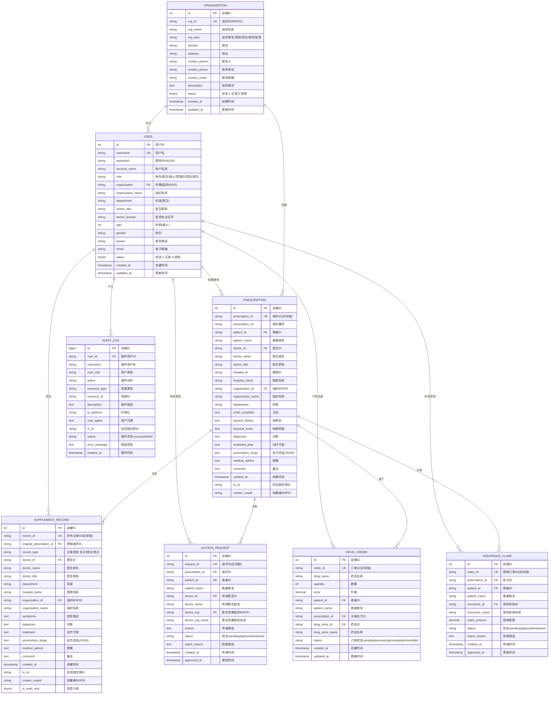

# 全局 ER 图 - 医疗信息管理系统

## 系统概述

基于Hyperledger Fabric区块链的医疗信息管理系统（MIMS），实现跨组织的医疗数据共享、隐私保护和授权管理。

## 完整全局 ER 图



## 实体关系说明

### 1. 组织 - 用户 (1:N)
- 一个组织可以包含多个用户
- 医生和管理员必须属于某个组织
- 患者、药店、保险机构可以不属于组织

### 2. 用户 - 病历 (1:N)
- 医生创建病历：一个医生可以创建多个病历
- 患者拥有病历：一个患者可以拥有多个病历
- 每个病历由一个医生创建，属于一个患者

### 3. 病历 - 补充记录 (1:N，标识关系)
- 一个病历可以有多个补充记录
- 补充记录是弱实体，依赖于病历存在
- 补充记录记录病情变化和后续诊疗

### 4. 用户 - 授权请求 (1:N)
- 医生申请授权：一个医生可以发起多个授权请求
- 患者审批授权：一个患者可以审批多个授权请求
- 实现跨组织访问控制

### 5. 病历 - 授权请求 (1:N)
- 一个病历可以有多个授权请求
- 不同医生可以申请访问同一病历

### 6. 用户 - 药品订单 (1:N)
- 患者下单：一个患者可以下多个订单
- 药店处理：一个药店可以处理多个订单

### 7. 病历 - 药品订单 (1:N)
- 一个病历可以生成多个药品订单
- 订单必须基于有效的处方

### 8. 用户 - 保险报销 (1:N)
- 患者申请：一个患者可以提交多个报销申请
- 保险机构审批：一个保险机构可以审批多个报销申请

### 9. 病历 - 保险报销 (1:N)
- 一个病历可以关联多个报销申请
- 报销申请必须基于有效的处方

### 10. 用户 - 审计日志 (1:N)
- 一个用户可以产生多个审计日志
- 所有操作都会记录审计日志

## 核心业务流程

### 流程1: 病历创建与管理
```
医生登录 → 创建病历 → 写入区块链 → 缓存到MySQL → 患者可查看
```

### 流程2: 跨组织授权访问
```
外院医生申请授权 → 患者收到通知 → 患者审批 → 授权写入区块链 → 医生可访问病历
```

### 流程3: 补充记录添加
```
医生查看病历 → 添加补充记录 → 写入区块链 → 关联到原病历 → 更新病历历史
```

### 流程4: 药品订单处理
```
患者查看处方 → 选择药店下单 → 订单写入区块链 → 药店处理订单 → 订单完成
```

### 流程5: 保险报销申请
```
患者提交报销申请 → 保险机构审核 → 审批结果写入区块链 → 患者收到通知
```

### 流程6: 审计追踪
```
用户操作 → 记录审计日志 → 存储到数据库 → 监管部门可查看 → 安全分析
```

## 数据完整性约束

### 实体完整性
- 所有表的主键不能为空且唯一
- 区块链ID (prescription_id, record_id等) 作为唯一键

### 参照完整性
- USER.organization → ORGANIZATION.org_id
- PRESCRIPTION.doctor_id → USER.id
- PRESCRIPTION.patient_id → USER.id
- PRESCRIPTION.organization_id → ORGANIZATION.org_id
- SUPPLEMENT_RECORD.original_prescription_id → PRESCRIPTION.prescription_id
- SUPPLEMENT_RECORD.doctor_id → USER.id
- ACCESS_REQUEST.prescription_id → PRESCRIPTION.prescription_id
- ACCESS_REQUEST.patient_id → USER.id
- ACCESS_REQUEST.doctor_id → USER.id
- DRUG_ORDER.patient_id → USER.id
- DRUG_ORDER.prescription_id → PRESCRIPTION.prescription_id
- DRUG_ORDER.drug_store_id → USER.id
- INSURANCE_CLAIM.prescription_id → PRESCRIPTION.prescription_id
- INSURANCE_CLAIM.patient_id → USER.id
- INSURANCE_CLAIM.insurance_id → USER.id
- AUDIT_LOG.user_id → USER.id

### 用户定义完整性
- 角色字段: 医生/病人/管理员/药店/保险机构
- 状态字段: pending/approved/rejected/completed/cancelled
- 数量、价格必须大于0
- 时间戳字段不能为空

## 系统特点

### 1. 去中心化
- 多组织联盟链架构
- 数据分布式存储
- 无单点故障

### 2. 数据隐私
- 患者数据加密存储
- 基于授权的访问控制
- 跨组织数据隔离

### 3. 可追溯性
- 所有操作记录在区块链上
- 完整的审计日志
- 不可篡改的历史记录

### 4. 跨组织协作
- 支持不同医疗机构间的数据共享
- 患者控制的授权机制
- 统一的数据标准

### 5. 高性能
- MySQL缓存提供快速查询
- 区块链保证数据一致性
- 读写分离架构

### 6. 可扩展
- 支持新组织加入联盟链
- 灵活的权限管理
- 模块化设计

## 技术架构

### 后端技术栈
- 语言: Go (Golang)
- 框架: Gin Web Framework
- 数据库: MySQL 8.0
- 区块链: Hyperledger Fabric 2.x
- SDK: Fabric SDK Go

### 前端技术栈
- 框架: Vue.js 3
- UI库: Element Plus
- 路由: Vue Router
- 状态管理: Pinia

### 区块链技术栈
- 平台: Hyperledger Fabric
- 智能合约: Go Chaincode
- 共识算法: Raft
- 通道: appchannel

## 安全特性

1. 身份认证: 基于用户名密码的认证机制
2. 权限控制: 基于角色的访问控制(RBAC)
3. 数据加密: 密码SHA256哈希存储
4. 区块链不可篡改: 所有关键操作写入区块链
5. 审计日志: 完整的操作日志记录
6. 跨组织授权: 患者控制的数据访问权限

## 统计视图

### 病历统计视图
```sql
CREATE OR REPLACE VIEW v_prescription_statistics AS
SELECT 
    organization_id,
    organization_name,
    COUNT(*) as total_prescriptions,
    COUNT(DISTINCT patient_id) as total_patients,
    COUNT(DISTINCT doctor_id) as total_doctors,
    DATE(created_at) as date
FROM prescriptions
GROUP BY organization_id, organization_name, DATE(created_at);
```

### 用户统计视图
```sql
CREATE OR REPLACE VIEW v_user_statistics AS
SELECT 
    role,
    organization,
    organization_name,
    COUNT(*) as user_count,
    SUM(CASE WHEN status = 1 THEN 1 ELSE 0 END) as active_count,
    SUM(CASE WHEN status = 0 THEN 1 ELSE 0 END) as inactive_count
FROM users
GROUP BY role, organization, organization_name;
```

## 文档索引

1. [用户实体 ER 图](./01-user-entity.md)
2. [病历实体 ER 图](./02-prescription-entity.md)
3. [补充记录实体 ER 图](./03-supplement-record-entity.md)
4. [授权请求实体 ER 图](./04-access-request-entity.md)
5. [药品订单实体 ER 图](./05-drug-order-entity.md)
6. [保险报销实体 ER 图](./06-insurance-claim-entity.md)
7. [组织机构实体 ER 图](./07-organization-entity.md)
8. [审计日志实体 ER 图](./08-audit-log-entity.md)

---

**生成时间**: 2026-04-03  
**系统版本**: v1.0  
**文档作者**: Kiro AI Assistant
