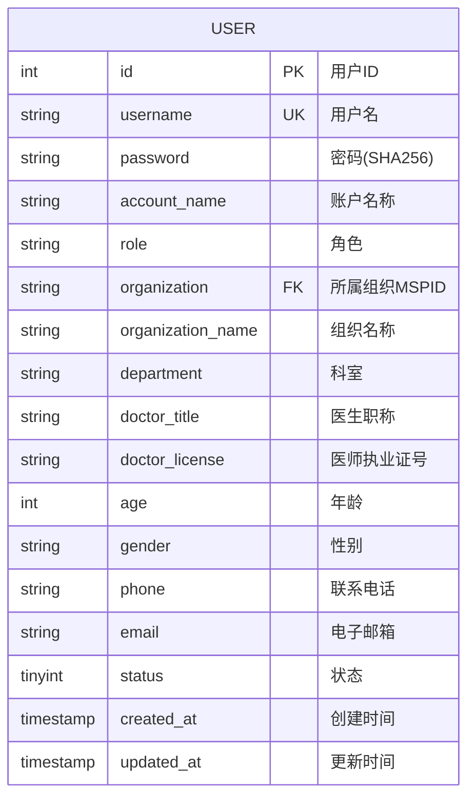

# 用户实体 ER 图

## 实体说明
用户实体是系统的核心实体，统一管理所有角色用户（医生、患者、药店、保险机构、管理员）。

## ER 图



## 实例数据

### 实例1: 医生用户
```json
{
  "id": 1,
  "username": "doctor_zhang",
  "password": "ef92b778bafe771e89245b89ecbc08a44a4e166c06659911881f383d4473e94f",
  "account_name": "张医生",
  "role": "医生",
  "organization": "TaobaoMSP",
  "organization_name": "协和医院",
  "department": "心内科",
  "doctor_title": "主任医师",
  "doctor_license": "110101199001011234",
  "age": null,
  "gender": "男",
  "phone": "13800138001",
  "email": "zhang.doctor@xiehe.com",
  "status": 1,
  "created_at": "2024-01-15 08:30:00",
  "updated_at": "2024-01-15 08:30:00"
}
```

### 实例2: 患者用户
```json
{
  "id": 2,
  "username": "patient_li",
  "password": "a665a45920422f9d417e4867efdc4fb8a04a1f3fff1fa07e998e86f7f7a27ae3",
  "account_name": "李明",
  "role": "病人",
  "organization": "",
  "organization_name": "",
  "department": null,
  "doctor_title": null,
  "doctor_license": null,
  "age": 45,
  "gender": "男",
  "phone": "13900139002",
  "email": "liming@example.com",
  "status": 1,
  "created_at": "2024-02-01 10:15:00",
  "updated_at": "2024-02-01 10:15:00"
}
```

### 实例3: 药店用户
```json
{
  "id": 3,
  "username": "pharmacy_renhe",
  "password": "a665a45920422f9d417e4867efdc4fb8a04a1f3fff1fa07e998e86f7f7a27ae3",
  "account_name": "仁和药店",
  "role": "药店",
  "organization": "",
  "organization_name": "",
  "department": null,
  "doctor_title": null,
  "doctor_license": null,
  "age": null,
  "gender": null,
  "phone": "010-88888888",
  "email": "contact@renhe-pharmacy.com",
  "status": 1,
  "created_at": "2024-01-10 09:00:00",
  "updated_at": "2024-01-10 09:00:00"
}
```

### 实例4: 保险机构用户
```json
{
  "id": 4,
  "username": "insurance_pingan",
  "password": "a665a45920422f9d417e4867efdc4fb8a04a1f3fff1fa07e998e86f7f7a27ae3",
  "account_name": "平安保险",
  "role": "保险机构",
  "organization": "",
  "organization_name": "",
  "department": null,
  "doctor_title": null,
  "doctor_license": null,
  "age": null,
  "gender": null,
  "phone": "400-800-8000",
  "email": "service@pingan.com",
  "status": 1,
  "created_at": "2024-01-05 14:20:00",
  "updated_at": "2024-01-05 14:20:00"
}
```

### 实例5: 管理员用户
```json
{
  "id": 5,
  "username": "admin",
  "password": "240be518fabd2724ddb6f04eeb1da5967448d7e831c08c8fa822809f74c720a9",
  "account_name": "系统管理员",
  "role": "管理员",
  "organization": "TaobaoMSP",
  "organization_name": "协和医院",
  "department": "信息科",
  "doctor_title": null,
  "doctor_license": null,
  "age": null,
  "gender": "男",
  "phone": "010-12345678",
  "email": "admin@xiehe.com",
  "status": 1,
  "created_at": "2024-01-01 00:00:00",
  "updated_at": "2024-01-01 00:00:00"
}
```

## 属性说明

| 属性名 | 类型 | 约束 | 说明 |
|--------|------|------|------|
| id | INT | PK, AUTO_INCREMENT | 用户唯一标识 |
| username | VARCHAR(255) | UNIQUE, NOT NULL | 登录账号，全局唯一 |
| password | VARCHAR(255) | NOT NULL | SHA256哈希加密密码 |
| account_name | VARCHAR(255) | NOT NULL | 显示名称 |
| role | VARCHAR(50) | NOT NULL | 角色类型：医生/病人/管理员/药店/保险机构 |
| organization | VARCHAR(100) | | 所属组织MSPID（医生、管理员使用） |
| organization_name | VARCHAR(200) | | 组织名称 |
| department | VARCHAR(100) | | 科室（医生专用） |
| doctor_title | VARCHAR(50) | | 医生职称（医生专用） |
| doctor_license | VARCHAR(100) | | 医师执业证号（医生专用） |
| age | INT | | 年龄（病人专用） |
| gender | VARCHAR(10) | | 性别 |
| phone | VARCHAR(20) | | 联系电话 |
| email | VARCHAR(100) | | 电子邮箱 |
| status | TINYINT | DEFAULT 1 | 状态：1-正常，0-禁用 |
| created_at | TIMESTAMP | DEFAULT CURRENT_TIMESTAMP | 创建时间 |
| updated_at | TIMESTAMP | ON UPDATE CURRENT_TIMESTAMP | 更新时间 |

## 业务规则

1. **角色区分**: 通过 `role` 字段区分不同类型用户
2. **组织归属**: 医生和管理员必须属于某个组织（医院）
3. **专用字段**: 
   - 医生：department, doctor_title, doctor_license
   - 患者：age
4. **状态管理**: status=0 表示账号被禁用
5. **密码安全**: 密码使用SHA256哈希存储，不可逆

## 索引设计

- PRIMARY KEY: `id`
- UNIQUE KEY: `username`
- INDEX: `role`, `organization`, `status`
