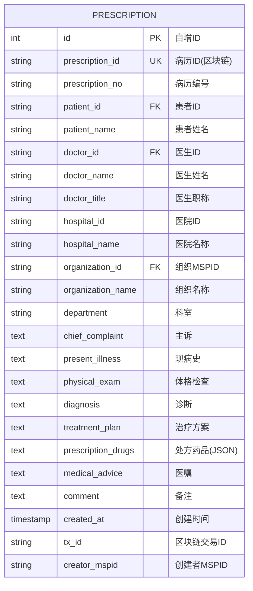

# 病历实体 ER 图

## 实体说明
病历实体是医疗记录的核心实体，存储患者的完整诊疗信息，数据同时存储在区块链和MySQL数据库中。

## ER 图



## 实例数据

### 实例1: 心内科门诊病历
```json
{
  "id": 1,
  "prescription_id": "PRESC-2024-0001-XH",
  "prescription_no": "XH20240215001",
  "patient_id": "2",
  "patient_name": "李明",
  "doctor_id": "1",
  "doctor_name": "张医生",
  "doctor_title": "主任医师",
  "hospital_id": "HOSP-XH-001",
  "hospital_name": "协和医院",
  "organization_id": "TaobaoMSP",
  "organization_name": "协和医院",
  "department": "心内科",
  "chief_complaint": "胸闷、气短3天",
  "present_illness": "患者3天前无明显诱因出现胸闷、气短，活动后加重，伴有心悸，无胸痛、咳嗽、咳痰。既往有高血压病史5年，规律服药控制。",
  "physical_exam": "T: 36.5℃, P: 88次/分, R: 18次/分, BP: 145/90mmHg。心界不大，心率88次/分，律齐，各瓣膜听诊区未闻及病理性杂音。双肺呼吸音清，未闻及干湿性啰音。",
  "diagnosis": "1. 冠心病 心绞痛\n2. 高血压病 2级",
  "treatment_plan": "1. 低盐低脂饮食\n2. 适当休息，避免劳累\n3. 药物治疗：见处方\n4. 1周后复查心电图",
  "prescription_drugs": "[{\"name\":\"阿司匹林肠溶片\",\"specification\":\"100mg\",\"quantity\":\"30片\",\"usage\":\"口服，每日1次，每次100mg\",\"frequency\":\"每日1次\"},{\"name\":\"阿托伐他汀钙片\",\"specification\":\"20mg\",\"quantity\":\"30片\",\"usage\":\"口服，每晚1次，每次20mg\",\"frequency\":\"每日1次\"},{\"name\":\"硝酸异山梨酯片\",\"specification\":\"5mg\",\"quantity\":\"60片\",\"usage\":\"口服，每日2次，每次5mg\",\"frequency\":\"每日2次\"}]",
  "medical_advice": "1. 按时服药，不可自行停药\n2. 监测血压，保持在130/80mmHg以下\n3. 如出现胸痛加重、持续不缓解，立即就诊\n4. 戒烟限酒，适量运动\n5. 1周后门诊复查",
  "comment": "患者依从性好，血压控制尚可",
  "created_at": "2024-02-15 10:30:00",
  "tx_id": "a1b2c3d4e5f6g7h8i9j0k1l2m3n4o5p6",
  "creator_mspid": "TaobaoMSP"
}
```

### 实例2: 呼吸内科急诊病历
```json
{
  "id": 2,
  "prescription_id": "PRESC-2024-0002-301",
  "prescription_no": "301-20240220-ER-001",
  "patient_id": "6",
  "patient_name": "王芳",
  "doctor_id": "7",
  "doctor_name": "李医生",
  "doctor_title": "副主任医师",
  "hospital_id": "HOSP-301-001",
  "hospital_name": "301医院",
  "organization_id": "JDMSP",
  "organization_name": "301医院",
  "department": "呼吸内科",
  "chief_complaint": "发热、咳嗽2天",
  "present_illness": "患者2天前受凉后出现发热，最高体温38.5℃，伴有咳嗽、咳白色粘痰，无咯血、胸痛。自服感冒药后症状无明显缓解。",
  "physical_exam": "T: 38.2℃, P: 92次/分, R: 20次/分, BP: 120/75mmHg。咽部充血，扁桃体无肿大。双肺呼吸音粗，右下肺可闻及湿性啰音。心律齐，未闻及杂音。",
  "diagnosis": "1. 急性支气管炎\n2. 上呼吸道感染",
  "treatment_plan": "1. 多饮水，注意休息\n2. 抗感染治疗\n3. 对症治疗：退热、止咳\n4. 3天后复诊",
  "prescription_drugs": "[{\"name\":\"阿莫西林胶囊\",\"specification\":\"0.5g\",\"quantity\":\"21粒\",\"usage\":\"口服，每日3次，每次0.5g\",\"frequency\":\"每日3次\"},{\"name\":\"对乙酰氨基酚片\",\"specification\":\"0.5g\",\"quantity\":\"12片\",\"usage\":\"口服，发热时服用，每次0.5g，间隔4-6小时\",\"frequency\":\"必要时\"},{\"name\":\"氨溴索口服液\",\"specification\":\"30mg/10ml\",\"quantity\":\"3瓶\",\"usage\":\"口服，每日3次，每次10ml\",\"frequency\":\"每日3次\"}]",
  "medical_advice": "1. 多饮水，每日至少2000ml\n2. 注意保暖，避免再次受凉\n3. 按时服药，完成抗生素疗程\n4. 如体温持续不退或症状加重，及时复诊\n5. 3天后门诊复查",
  "comment": "急诊就诊，病情较轻",
  "created_at": "2024-02-20 15:45:00",
  "tx_id": "b2c3d4e5f6g7h8i9j0k1l2m3n4o5p6q7",
  "creator_mspid": "JDMSP"
}
```

### 实例3: 内分泌科复诊病历
```json
{
  "id": 3,
  "prescription_id": "PRESC-2024-0003-WJ",
  "prescription_no": "WJ20240225003",
  "patient_id": "8",
  "patient_name": "赵强",
  "doctor_id": "9",
  "doctor_name": "王医生",
  "doctor_title": "主治医师",
  "hospital_id": "HOSP-WJ-001",
  "hospital_name": "温江社区医疗中心",
  "organization_id": "WenjinMSP",
  "organization_name": "温江社区医疗中心",
  "department": "内分泌科",
  "chief_complaint": "糖尿病复诊",
  "present_illness": "患者确诊2型糖尿病3年，规律服用二甲双胍治疗。近1月自测空腹血糖6.5-7.2mmol/L，餐后2小时血糖8.5-10.0mmol/L。无明显多饮、多尿、多食症状。",
  "physical_exam": "T: 36.6℃, P: 76次/分, R: 18次/分, BP: 130/80mmHg, BMI: 26.5。神志清，精神可。心肺腹查体未见异常。双足背动脉搏动良好，皮肤完整。",
  "diagnosis": "2型糖尿病",
  "treatment_plan": "1. 继续饮食控制，低糖低脂饮食\n2. 坚持运动，每日30分钟有氧运动\n3. 调整药物剂量\n4. 定期监测血糖\n5. 3个月后复查糖化血红蛋白",
  "prescription_drugs": "[{\"name\":\"二甲双胍缓释片\",\"specification\":\"0.5g\",\"quantity\":\"90片\",\"usage\":\"口服，每日2次，每次0.5g，餐后服用\",\"frequency\":\"每日2次\"},{\"name\":\"阿卡波糖片\",\"specification\":\"50mg\",\"quantity\":\"90片\",\"usage\":\"口服，每日3次，每次50mg，餐前即刻服用\",\"frequency\":\"每日3次\"}]",
  "medical_advice": "1. 严格控制饮食，避免高糖高脂食物\n2. 坚持规律运动\n3. 按时服药，不可自行停药或调整剂量\n4. 每日监测空腹及餐后2小时血糖，记录血糖日记\n5. 注意足部护理，预防糖尿病足\n6. 3个月后复查糖化血红蛋白、肝肾功能",
  "comment": "血糖控制尚可，需继续监测",
  "created_at": "2024-02-25 09:20:00",
  "tx_id": "c3d4e5f6g7h8i9j0k1l2m3n4o5p6q7r8",
  "creator_mspid": "WenjinMSP"
}
```

## 属性说明

| 属性名 | 类型 | 约束 | 说明 |
|--------|------|------|------|
| id | INT | PK, AUTO_INCREMENT | 数据库自增ID |
| prescription_id | VARCHAR(100) | UNIQUE, NOT NULL | 区块链病历ID，全局唯一 |
| prescription_no | VARCHAR(100) | NOT NULL | 病历业务编号 |
| patient_id | VARCHAR(100) | NOT NULL, FK | 患者ID，关联用户表 |
| patient_name | VARCHAR(100) | NOT NULL | 患者姓名 |
| doctor_id | VARCHAR(100) | NOT NULL, FK | 医生ID，关联用户表 |
| doctor_name | VARCHAR(100) | NOT NULL | 医生姓名 |
| doctor_title | VARCHAR(50) | | 医生职称 |
| hospital_id | VARCHAR(100) | | 医院ID |
| hospital_name | VARCHAR(200) | | 医院名称 |
| organization_id | VARCHAR(100) | NOT NULL, FK | 组织MSPID |
| organization_name | VARCHAR(200) | NOT NULL | 组织名称 |
| department | VARCHAR(100) | | 科室 |
| chief_complaint | TEXT | | 主诉：患者主要症状 |
| present_illness | TEXT | | 现病史：疾病发展过程 |
| physical_exam | TEXT | | 体格检查结果 |
| diagnosis | TEXT | | 诊断结论 |
| treatment_plan | TEXT | | 治疗方案 |
| prescription_drugs | TEXT | | 处方药品（JSON格式） |
| medical_advice | TEXT | | 医嘱 |
| comment | TEXT | | 备注 |
| created_at | TIMESTAMP | DEFAULT CURRENT_TIMESTAMP | 创建时间 |
| tx_id | VARCHAR(100) | | 区块链交易ID |
| creator_mspid | VARCHAR(100) | | 创建者组织MSPID |

## 处方药品JSON格式

```json
[
  {
    "name": "药品名称",
    "specification": "规格",
    "quantity": "数量",
    "usage": "用法",
    "frequency": "频次"
  }
]
```

## 业务规则

1. **唯一性**: prescription_id 在区块链中全局唯一
2. **关联关系**: 
   - patient_id 关联到 USER 表
   - doctor_id 关联到 USER 表（角色必须是医生）
   - organization_id 关联到 ORGANIZATION 表
3. **数据同步**: 数据同时写入区块链和MySQL，MySQL作为缓存提供快速查询
4. **不可篡改**: 区块链中的病历数据不可修改，只能添加补充记录
5. **访问控制**: 
   - 患者可查看自己的所有病历
   - 医生可查看本组织内的病历
   - 跨组织访问需要患者授权

## 索引设计

- PRIMARY KEY: `id`
- UNIQUE KEY: `prescription_id`
- INDEX: `patient_id`, `doctor_id`, `organization_id`, `created_at`, `prescription_no`

## 区块链特性

- **交易ID**: tx_id 记录区块链交易哈希
- **创建者**: creator_mspid 记录创建病历的组织
- **不可篡改**: 病历一旦创建，核心信息不可修改
- **可追溯**: 通过区块链可追溯病历的完整历史
