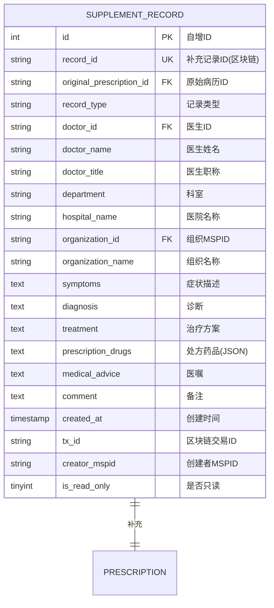

# 补充记录实体 ER 图

## 实体说明
补充记录实体是依赖于病历实体的弱实体，用于存储对原始病历的补充信息，如复诊、随访、急诊等记录。

## ER 图



## 实例数据

### 实例1: 心内科复诊记录
```json
{
  "id": 1,
  "record_id": "SUPP-2024-0001-XH",
  "original_prescription_id": "PRESC-2024-0001-XH",
  "record_type": "复诊",
  "doctor_id": "1",
  "doctor_name": "张医生",
  "doctor_title": "主任医师",
  "department": "心内科",
  "hospital_name": "协和医院",
  "organization_id": "TaobaoMSP",
  "organization_name": "协和医院",
  "symptoms": "患者复诊，诉胸闷、气短症状较前明显好转，偶有心悸，无胸痛。规律服药，血压控制良好。",
  "diagnosis": "1. 冠心病 心绞痛（病情稳定）\n2. 高血压病 2级（控制良好）",
  "treatment": "1. 继续原治疗方案\n2. 调整硝酸异山梨酯剂量\n3. 继续低盐低脂饮食\n4. 适当运动",
  "prescription_drugs": "[{\"name\":\"阿司匹林肠溶片\",\"specification\":\"100mg\",\"quantity\":\"30片\",\"usage\":\"口服，每日1次，每次100mg\",\"frequency\":\"每日1次\"},{\"name\":\"阿托伐他汀钙片\",\"specification\":\"20mg\",\"quantity\":\"30片\",\"usage\":\"口服，每晚1次，每次20mg\",\"frequency\":\"每日1次\"},{\"name\":\"硝酸异山梨酯片\",\"specification\":\"5mg\",\"quantity\":\"30片\",\"usage\":\"口服，每日1次，每次5mg（减量）\",\"frequency\":\"每日1次\"}]",
  "medical_advice": "1. 继续按时服药\n2. 监测血压，保持在130/80mmHg以下\n3. 症状改善，可适当增加活动量\n4. 1个月后复查心电图和血脂\n5. 如有不适随时就诊",
  "comment": "患者症状明显改善，治疗效果良好，调整用药剂量",
  "created_at": "2024-02-22 14:30:00",
  "tx_id": "d4e5f6g7h8i9j0k1l2m3n4o5p6q7r8s9",
  "creator_mspid": "TaobaoMSP",
  "is_read_only": 1
}
```

### 实例2: 呼吸内科随访记录
```json
{
  "id": 2,
  "record_id": "SUPP-2024-0002-301",
  "original_prescription_id": "PRESC-2024-0002-301",
  "record_type": "随访",
  "doctor_id": "7",
  "doctor_name": "李医生",
  "doctor_title": "副主任医师",
  "department": "呼吸内科",
  "hospital_name": "301医院",
  "organization_id": "JDMSP",
  "organization_name": "301医院",
  "symptoms": "电话随访：患者诉发热、咳嗽症状已完全消失，体温正常，无咳嗽咳痰。已完成抗生素疗程。",
  "diagnosis": "急性支气管炎（已治愈）",
  "treatment": "1. 已完成治疗\n2. 注意休息，避免受凉\n3. 增强体质，预防感冒",
  "prescription_drugs": "[]",
  "medical_advice": "1. 注意保暖，预防感冒\n2. 适当锻炼，增强体质\n3. 多饮水，保持室内空气流通\n4. 如有不适及时就诊",
  "comment": "电话随访，患者已痊愈，无需继续用药",
  "created_at": "2024-02-23 10:00:00",
  "tx_id": "e5f6g7h8i9j0k1l2m3n4o5p6q7r8s9t0",
  "creator_mspid": "JDMSP",
  "is_read_only": 1
}
```

### 实例3: 急诊补充记录
```json
{
  "id": 3,
  "record_id": "SUPP-2024-0003-XH-ER",
  "original_prescription_id": "PRESC-2024-0001-XH",
  "record_type": "急诊",
  "doctor_id": "10",
  "doctor_name": "赵医生",
  "doctor_title": "主治医师",
  "department": "急诊科",
  "hospital_name": "协和医院",
  "organization_id": "TaobaoMSP",
  "organization_name": "协和医院",
  "symptoms": "患者夜间突发胸痛，持续性，伴大汗、恶心。既往有冠心病史。急诊就诊。",
  "diagnosis": "1. 急性冠脉综合征？\n2. 不稳定型心绞痛",
  "treatment": "1. 立即心电图检查\n2. 吸氧\n3. 舌下含服硝酸甘油\n4. 阿司匹林300mg嚼服\n5. 急查心肌酶、肌钙蛋白\n6. 建议住院观察治疗",
  "prescription_drugs": "[{\"name\":\"硝酸甘油片\",\"specification\":\"0.5mg\",\"quantity\":\"1片\",\"usage\":\"舌下含服\",\"frequency\":\"立即\"},{\"name\":\"阿司匹林片\",\"specification\":\"100mg\",\"quantity\":\"3片\",\"usage\":\"嚼服\",\"frequency\":\"立即\"}]",
  "medical_advice": "1. 建议立即住院治疗\n2. 绝对卧床休息\n3. 持续心电监护\n4. 完善相关检查\n5. 根据检查结果决定进一步治疗方案",
  "comment": "急诊就诊，病情危重，已建议住院，患者同意住院治疗",
  "created_at": "2024-02-28 02:15:00",
  "tx_id": "f6g7h8i9j0k1l2m3n4o5p6q7r8s9t0u1",
  "creator_mspid": "TaobaoMSP",
  "is_read_only": 1
}
```

### 实例4: 跨组织复诊记录
```json
{
  "id": 4,
  "record_id": "SUPP-2024-0004-WJ",
  "original_prescription_id": "PRESC-2024-0003-WJ",
  "record_type": "复诊",
  "doctor_id": "9",
  "doctor_name": "王医生",
  "doctor_title": "主治医师",
  "department": "内分泌科",
  "hospital_name": "温江社区医疗中心",
  "organization_id": "WenjinMSP",
  "organization_name": "温江社区医疗中心",
  "symptoms": "患者复诊，诉血糖控制良好。近1周自测空腹血糖5.8-6.5mmol/L，餐后2小时血糖7.5-8.5mmol/L。无低血糖反应。",
  "diagnosis": "2型糖尿病（控制良好）",
  "treatment": "1. 继续原治疗方案\n2. 维持现有药物剂量\n3. 继续饮食控制和运动\n4. 定期监测血糖",
  "prescription_drugs": "[{\"name\":\"二甲双胍缓释片\",\"specification\":\"0.5g\",\"quantity\":\"90片\",\"usage\":\"口服，每日2次，每次0.5g，餐后服用\",\"frequency\":\"每日2次\"},{\"name\":\"阿卡波糖片\",\"specification\":\"50mg\",\"quantity\":\"90片\",\"usage\":\"口服，每日3次，每次50mg，餐前即刻服用\",\"frequency\":\"每日3次\"}]",
  "medical_advice": "1. 血糖控制良好，继续保持\n2. 坚持饮食控制和运动\n3. 按时服药\n4. 每日监测血糖\n5. 3个月后复查糖化血红蛋白",
  "comment": "血糖控制达标，患者依从性好",
  "created_at": "2024-03-25 09:45:00",
  "tx_id": "g7h8i9j0k1l2m3n4o5p6q7r8s9t0u1v2",
  "creator_mspid": "WenjinMSP",
  "is_read_only": 1
}
```

## 属性说明

| 属性名 | 类型 | 约束 | 说明 |
|--------|------|------|------|
| id | INT | PK, AUTO_INCREMENT | 数据库自增ID |
| record_id | VARCHAR(100) | UNIQUE, NOT NULL | 区块链补充记录ID |
| original_prescription_id | VARCHAR(100) | NOT NULL, FK | 原始病历ID，关联病历表 |
| record_type | VARCHAR(50) | NOT NULL | 记录类型：复诊/随访/急诊 |
| doctor_id | VARCHAR(100) | NOT NULL, FK | 医生ID |
| doctor_name | VARCHAR(100) | NOT NULL | 医生姓名 |
| doctor_title | VARCHAR(50) | | 医生职称 |
| department | VARCHAR(100) | | 科室 |
| hospital_name | VARCHAR(200) | | 医院名称 |
| organization_id | VARCHAR(100) | NOT NULL, FK | 组织MSPID |
| organization_name | VARCHAR(200) | NOT NULL | 组织名称 |
| symptoms | TEXT | | 症状描述 |
| diagnosis | TEXT | | 诊断 |
| treatment | TEXT | | 治疗方案 |
| prescription_drugs | TEXT | | 处方药品（JSON格式） |
| medical_advice | TEXT | | 医嘱 |
| comment | TEXT | | 备注 |
| created_at | TIMESTAMP | DEFAULT CURRENT_TIMESTAMP | 创建时间 |
| tx_id | VARCHAR(100) | | 区块链交易ID |
| creator_mspid | VARCHAR(100) | | 创建者MSPID |
| is_read_only | TINYINT | DEFAULT 1 | 是否只读：1-是，0-否 |

## 记录类型说明

| 类型 | 说明 | 使用场景 |
|------|------|----------|
| 复诊 | 患者按预约时间再次就诊 | 慢性病管理、治疗效果评估 |
| 随访 | 医生主动联系患者了解病情 | 电话随访、出院后随访 |
| 急诊 | 患者病情变化紧急就诊 | 病情加重、突发症状 |

## 业务规则

1. **弱实体**: 补充记录依赖于原始病历存在，original_prescription_id 必须有效
2. **关联关系**:
   - original_prescription_id 关联到 PRESCRIPTION 表
   - doctor_id 关联到 USER 表（角色必须是医生）
   - organization_id 关联到 ORGANIZATION 表
3. **跨组织补充**: 
   - 医生可以为其他组织的病历添加补充记录
   - 前提是已获得患者授权
4. **只读属性**: is_read_only=1 表示记录不可修改
5. **时间顺序**: 补充记录的创建时间必须晚于原始病历
6. **完整性**: 补充记录形成病历的完整历史链

## 索引设计

- PRIMARY KEY: `id`
- UNIQUE KEY: `record_id`
- INDEX: `original_prescription_id`, `doctor_id`, `organization_id`, `created_at`, `record_type`

## 区块链特性

- **不可篡改**: 补充记录一旦创建，不可修改
- **可追溯**: 通过区块链可追溯病历的完整补充历史
- **时间戳**: 区块链时间戳确保记录的时间顺序
- **跨组织**: 支持不同组织的医生添加补充记录

## 与病历的关系

```
病历 (1) ----包含----> (N) 补充记录

一个病历可以有多个补充记录
每个补充记录只属于一个病历
补充记录是弱实体，依赖于病历存在
```
