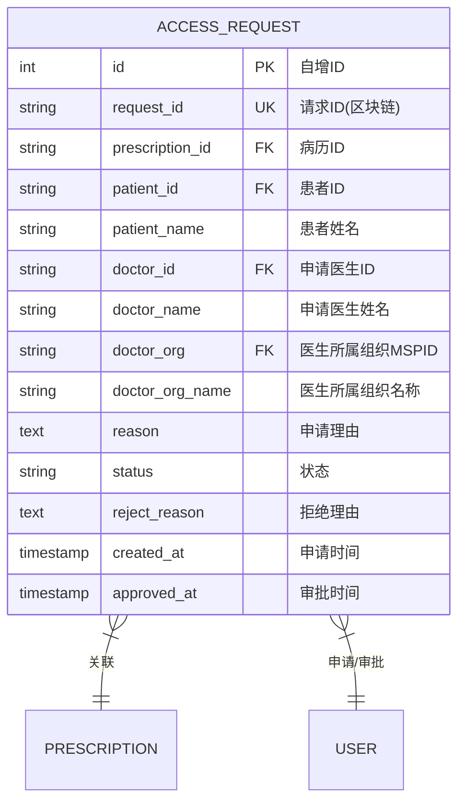

# 授权请求实体 ER 图

## 实体说明
授权请求实体管理跨组织访问病历的授权流程，实现患者对自己医疗数据的访问控制。

## ER 图



## 实例数据

### 实例1: 待审批的授权请求
```json
{
  "id": 1,
  "request_id": "ACCESS-2024-0001",
  "prescription_id": "PRESC-2024-0001-XH",
  "patient_id": "2",
  "patient_name": "李明",
  "doctor_id": "7",
  "doctor_name": "李医生",
  "doctor_org": "JDMSP",
  "doctor_org_name": "301医院",
  "reason": "患者因心脏不适来我院急诊就诊，需要查看既往心内科病历以便制定治疗方案。患者同意申请授权。",
  "status": "pending",
  "reject_reason": null,
  "created_at": "2024-02-28 08:30:00",
  "approved_at": null
}
```

### 实例2: 已批准的授权请求
```json
{
  "id": 2,
  "request_id": "ACCESS-2024-0002",
  "prescription_id": "PRESC-2024-0003-WJ",
  "patient_id": "8",
  "patient_name": "赵强",
  "doctor_id": "1",
  "doctor_name": "张医生",
  "doctor_org": "TaobaoMSP",
  "doctor_org_name": "协和医院",
  "reason": "患者转诊至我院内分泌科，需要查看既往糖尿病治疗记录，以便调整治疗方案。",
  "status": "approved",
  "reject_reason": null,
  "created_at": "2024-03-01 10:15:00",
  "approved_at": "2024-03-01 14:30:00"
}
```

### 实例3: 已拒绝的授权请求
```json
{
  "id": 3,
  "request_id": "ACCESS-2024-0003",
  "prescription_id": "PRESC-2024-0002-301",
  "patient_id": "6",
  "patient_name": "王芳",
  "doctor_id": "11",
  "doctor_name": "孙医生",
  "doctor_org": "WenjinMSP",
  "doctor_org_name": "温江社区医疗中心",
  "reason": "患者来我院就诊，需要了解既往病史。",
  "status": "rejected",
  "reject_reason": "申请理由不够充分，且患者表示不愿意授权查看该病历。",
  "created_at": "2024-03-05 09:00:00",
  "approved_at": "2024-03-05 16:45:00"
}
```

### 实例4: 紧急授权请求（已批准）
```json
{
  "id": 4,
  "request_id": "ACCESS-2024-0004-URGENT",
  "prescription_id": "PRESC-2024-0001-XH",
  "patient_id": "2",
  "patient_name": "李明",
  "doctor_id": "12",
  "doctor_name": "周医生",
  "doctor_org": "JDMSP",
  "doctor_org_name": "301医院",
  "reason": "【紧急】患者急诊入院，疑似急性心肌梗死，需要紧急查看既往心脏病史和用药记录，以便制定抢救方案。患者家属同意授权。",
  "status": "approved",
  "reject_reason": null,
  "created_at": "2024-03-10 02:30:00",
  "approved_at": "2024-03-10 02:35:00"
}
```

### 实例5: 科研授权请求（待审批）
```json
{
  "id": 5,
  "request_id": "ACCESS-2024-0005-RESEARCH",
  "prescription_id": "PRESC-2024-0003-WJ",
  "patient_id": "8",
  "patient_name": "赵强",
  "doctor_id": "13",
  "doctor_name": "钱医生",
  "doctor_org": "TaobaoMSP",
  "doctor_org_name": "协和医院",
  "reason": "我院正在开展糖尿病管理研究项目，需要收集患者的治疗数据用于科研分析。数据将匿名化处理，仅用于学术研究。",
  "status": "pending",
  "reject_reason": null,
  "created_at": "2024-03-15 11:00:00",
  "approved_at": null
}
```

## 属性说明

| 属性名 | 类型 | 约束 | 说明 |
|--------|------|------|------|
| id | INT | PK, AUTO_INCREMENT | 数据库自增ID |
| request_id | VARCHAR(100) | UNIQUE, NOT NULL | 区块链请求ID |
| prescription_id | VARCHAR(100) | NOT NULL, FK | 病历ID，关联病历表 |
| patient_id | VARCHAR(100) | NOT NULL, FK | 患者ID，关联用户表 |
| patient_name | VARCHAR(100) | NOT NULL | 患者姓名 |
| doctor_id | VARCHAR(100) | NOT NULL, FK | 申请医生ID，关联用户表 |
| doctor_name | VARCHAR(100) | NOT NULL | 申请医生姓名 |
| doctor_org | VARCHAR(100) | NOT NULL, FK | 医生所属组织MSPID |
| doctor_org_name | VARCHAR(200) | NOT NULL | 医生所属组织名称 |
| reason | TEXT | | 申请理由 |
| status | VARCHAR(20) | NOT NULL, DEFAULT 'pending' | 状态 |
| reject_reason | TEXT | | 拒绝理由（仅在拒绝时填写） |
| created_at | TIMESTAMP | DEFAULT CURRENT_TIMESTAMP | 申请时间 |
| approved_at | TIMESTAMP | NULL | 审批时间 |

## 状态说明

| 状态值 | 说明 | 后续操作 |
|--------|------|----------|
| pending | 待审批 | 患者可以批准或拒绝 |
| approved | 已批准 | 医生可以访问病历 |
| rejected | 已拒绝 | 医生无法访问病历 |

## 业务规则

1. **跨组织访问**: 
   - 只有当医生所属组织与病历创建组织不同时，才需要授权
   - 同组织内的医生可以直接访问本组织的病历
2. **患者控制**: 
   - 只有患者本人可以审批授权请求
   - 患者可以批准或拒绝授权
3. **申请理由**: 
   - 医生必须提供充分的申请理由
   - 理由应包括医疗必要性说明
4. **审批时效**: 
   - 紧急情况下，患者应尽快审批
   - 普通情况下，建议3个工作日内审批
5. **授权有效期**: 
   - 一次授权对应一次访问
   - 如需再次访问，需要重新申请
6. **拒绝理由**: 
   - 患者拒绝时可以填写拒绝理由
   - 拒绝理由可选填

## 授权流程

```
1. 医生发起授权请求
   ↓
2. 系统创建授权请求记录（status=pending）
   ↓
3. 患者收到通知
   ↓
4. 患者审批（批准/拒绝）
   ↓
5. 系统更新授权状态
   ├─ approved: 医生可以访问病历
   └─ rejected: 医生无法访问病历
```

## 索引设计

- PRIMARY KEY: `id`
- UNIQUE KEY: `request_id`
- INDEX: `patient_id`, `doctor_id`, `prescription_id`, `status`, `created_at`

## 区块链特性

- **不可篡改**: 授权请求和审批结果记录在区块链上，不可修改
- **可追溯**: 可以追溯所有的授权请求历史
- **透明性**: 患者可以查看所有针对自己病历的授权请求
- **隐私保护**: 未授权的医生无法访问病历内容

## 安全特性

1. **身份验证**: 
   - 申请医生必须是有效的医生用户
   - 审批患者必须是病历的所有者
2. **权限控制**: 
   - 只有患者本人可以审批
   - 医生只能查看已授权的病历
3. **审计追踪**: 
   - 所有授权请求和审批操作记录在审计日志中
   - 包括操作时间、操作人、操作结果
4. **通知机制**: 
   - 患者收到授权请求通知
   - 医生收到审批结果通知

## 典型场景

### 场景1: 转诊授权
患者从社区医院转诊到三甲医院，三甲医院医生需要查看既往病历。

### 场景2: 急诊授权
患者急诊就诊，医生需要紧急查看病史，患者或家属快速授权。

### 场景3: 第二诊疗意见
患者寻求其他医院的第二诊疗意见，授权专家查看病历。

### 场景4: 科研授权
医院开展科研项目，需要患者授权使用病历数据（匿名化）。

## 与其他实体的关系

```
患者 (1) ----审批----> (N) 授权请求
医生 (1) ----申请----> (N) 授权请求
病历 (1) ----关联----> (N) 授权请求

一个患者可以审批多个授权请求
一个医生可以发起多个授权请求
一个病历可以有多个授权请求
```
