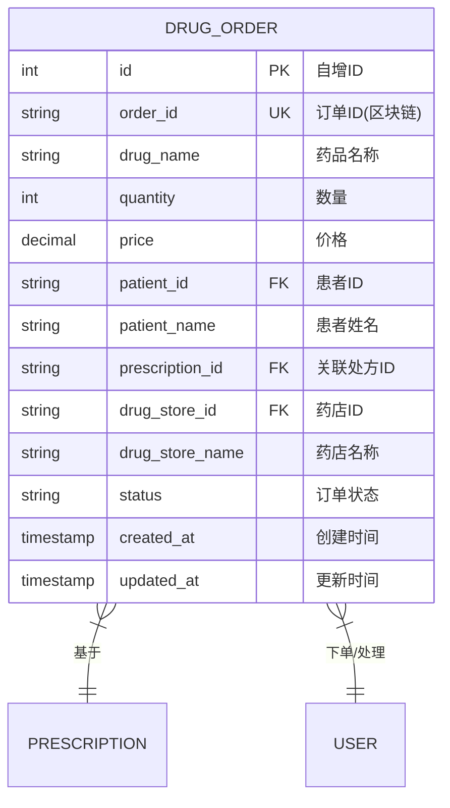

# 药品订单实体 ER 图

## 实体说明
药品订单实体处理患者基于处方的药品购买业务，连接医疗服务和药品零售。

## ER 图



## 实例数据

### 实例1: 待处理订单
```json
{
  "id": 1,
  "order_id": "ORDER-2024-0001",
  "drug_name": "阿司匹林肠溶片",
  "quantity": 30,
  "price": 15.80,
  "patient_id": "2",
  "patient_name": "李明",
  "prescription_id": "PRESC-2024-0001-XH",
  "drug_store_id": "3",
  "drug_store_name": "仁和药店",
  "status": "pending",
  "created_at": "2024-02-15 11:00:00",
  "updated_at": "2024-02-15 11:00:00"
}
```

### 实例2: 处理中订单
```json
{
  "id": 2,
  "order_id": "ORDER-2024-0002",
  "drug_name": "阿托伐他汀钙片",
  "quantity": 30,
  "price": 45.60,
  "patient_id": "2",
  "patient_name": "李明",
  "prescription_id": "PRESC-2024-0001-XH",
  "drug_store_id": "3",
  "drug_store_name": "仁和药店",
  "status": "processing",
  "created_at": "2024-02-15 11:00:00",
  "updated_at": "2024-02-15 11:30:00"
}
```

### 实例3: 已完成订单
```json
{
  "id": 3,
  "order_id": "ORDER-2024-0003",
  "drug_name": "硝酸异山梨酯片",
  "quantity": 60,
  "price": 12.50,
  "patient_id": "2",
  "patient_name": "李明",
  "prescription_id": "PRESC-2024-0001-XH",
  "drug_store_id": "3",
  "drug_store_name": "仁和药店",
  "status": "completed",
  "created_at": "2024-02-15 11:00:00",
  "updated_at": "2024-02-15 14:30:00"
}
```

### 实例4: 已取消订单
```json
{
  "id": 4,
  "order_id": "ORDER-2024-0004",
  "drug_name": "阿莫西林胶囊",
  "quantity": 21,
  "price": 18.90,
  "patient_id": "6",
  "patient_name": "王芳",
  "prescription_id": "PRESC-2024-0002-301",
  "drug_store_id": "14",
  "drug_store_name": "康泰药店",
  "status": "cancelled",
  "created_at": "2024-02-20 16:00:00",
  "updated_at": "2024-02-20 16:15:00"
}
```

### 实例5: 批量订单（多种药品）
```json
{
  "id": 5,
  "order_id": "ORDER-2024-0005",
  "drug_name": "二甲双胍缓释片",
  "quantity": 90,
  "price": 32.40,
  "patient_id": "8",
  "patient_name": "赵强",
  "prescription_id": "PRESC-2024-0003-WJ",
  "drug_store_id": "3",
  "drug_store_name": "仁和药店",
  "status": "completed",
  "created_at": "2024-02-25 10:00:00",
  "updated_at": "2024-02-25 15:20:00"
}
```

```json
{
  "id": 6,
  "order_id": "ORDER-2024-0006",
  "drug_name": "阿卡波糖片",
  "quantity": 90,
  "price": 56.70,
  "patient_id": "8",
  "patient_name": "赵强",
  "prescription_id": "PRESC-2024-0003-WJ",
  "drug_store_id": "3",
  "drug_store_name": "仁和药店",
  "status": "completed",
  "created_at": "2024-02-25 10:00:00",
  "updated_at": "2024-02-25 15:20:00"
}
```

## 属性说明

| 属性名 | 类型 | 约束 | 说明 |
|--------|------|------|------|
| id | INT | PK, AUTO_INCREMENT | 数据库自增ID |
| order_id | VARCHAR(100) | UNIQUE, NOT NULL | 区块链订单ID |
| drug_name | VARCHAR(200) | NOT NULL | 药品名称 |
| quantity | INT | NOT NULL | 数量（片/粒/盒） |
| price | DECIMAL(10,2) | NOT NULL | 单价（元） |
| patient_id | VARCHAR(100) | NOT NULL, FK | 患者ID，关联用户表 |
| patient_name | VARCHAR(100) | NOT NULL | 患者姓名 |
| prescription_id | VARCHAR(100) | NOT NULL, FK | 关联处方ID |
| drug_store_id | VARCHAR(100) | NOT NULL, FK | 药店ID，关联用户表 |
| drug_store_name | VARCHAR(200) | NOT NULL | 药店名称 |
| status | VARCHAR(20) | NOT NULL, DEFAULT 'pending' | 订单状态 |
| created_at | TIMESTAMP | DEFAULT CURRENT_TIMESTAMP | 创建时间 |
| updated_at | TIMESTAMP | ON UPDATE CURRENT_TIMESTAMP | 更新时间 |

## 订单状态说明

| 状态值 | 说明 | 可执行操作 |
|--------|------|-----------|
| pending | 待处理 | 药店接单、患者取消 |
| processing | 处理中 | 药店完成、患者取消 |
| completed | 已完成 | 无（终态） |
| cancelled | 已取消 | 无（终态） |

## 业务规则

1. **处方依据**: 
   - 订单必须基于有效的处方
   - 药品名称必须在处方药品列表中
2. **数量限制**: 
   - 订单数量不能超过处方开具的数量
   - 数量必须大于0
3. **价格计算**: 
   - 价格由药店设定
   - 总金额 = 单价 × 数量
4. **状态流转**: 
   ```
   pending → processing → completed
   pending → cancelled
   processing → cancelled
   ```
5. **取消规则**: 
   - 患者可以在 pending 和 processing 状态下取消订单
   - completed 状态的订单不能取消
6. **处方药管理**: 
   - 处方药必须凭处方购买
   - 系统自动验证处方有效性

## 订单处理流程

```
1. 患者查看处方
   ↓
2. 选择药店和药品
   ↓
3. 创建订单（status=pending）
   ↓
4. 药店接单（status=processing）
   ↓
5. 药店配药、患者取药
   ↓
6. 订单完成（status=completed）

取消流程：
pending/processing → 患者/药店取消 → cancelled
```

## 索引设计

- PRIMARY KEY: `id`
- UNIQUE KEY: `order_id`
- INDEX: `patient_id`, `prescription_id`, `drug_store_id`, `status`, `created_at`

## 区块链特性

- **不可篡改**: 订单记录在区块链上，状态变更可追溯
- **可追溯**: 可以追溯订单的完整生命周期
- **透明性**: 患者、药店、监管部门都可以查看订单信息
- **处方验证**: 区块链确保处方的真实性和有效性

## 扩展功能

### 1. 订单金额计算
```sql
-- 单个订单总金额
SELECT order_id, drug_name, quantity, price, 
       (quantity * price) AS total_amount
FROM drug_orders
WHERE order_id = 'ORDER-2024-0001';

-- 患者订单总金额
SELECT patient_id, patient_name, 
       SUM(quantity * price) AS total_amount
FROM drug_orders
WHERE patient_id = '2' AND status = 'completed'
GROUP BY patient_id, patient_name;
```

### 2. 药店销售统计
```sql
-- 药店销售统计
SELECT drug_store_id, drug_store_name,
       COUNT(*) AS order_count,
       SUM(quantity * price) AS total_sales
FROM drug_orders
WHERE status = 'completed'
GROUP BY drug_store_id, drug_store_name
ORDER BY total_sales DESC;
```

### 3. 热销药品统计
```sql
-- 热销药品TOP10
SELECT drug_name,
       COUNT(*) AS order_count,
       SUM(quantity) AS total_quantity,
       SUM(quantity * price) AS total_sales
FROM drug_orders
WHERE status = 'completed'
GROUP BY drug_name
ORDER BY total_sales DESC
LIMIT 10;
```

## 与其他实体的关系

```
患者 (1) ----下单----> (N) 药品订单
药店 (1) ----处理----> (N) 药品订单
处方 (1) ----生成----> (N) 药品订单

一个患者可以下多个订单
一个药店可以处理多个订单
一个处方可以生成多个订单（不同药品）
```

## 典型场景

### 场景1: 患者购药
患者查看处方后，选择附近药店下单购买处方药品。

### 场景2: 药店配药
药店接收订单后，配药并通知患者取药。

### 场景3: 订单取消
患者因故取消订单，或药店因缺货取消订单。

### 场景4: 批量购药
患者一次性购买处方中的多种药品，生成多个订单。

## 安全与合规

1. **处方验证**: 
   - 系统自动验证处方的真实性
   - 防止伪造处方购药
2. **药品管理**: 
   - 处方药必须凭处方购买
   - 非处方药可以直接购买
3. **数量控制**: 
   - 限制单次购买数量
   - 防止药品滥用
4. **审计追踪**: 
   - 所有订单操作记录在审计日志中
   - 监管部门可以查看订单历史

## 未来扩展

1. **配送服务**: 增加配送地址、配送状态等字段
2. **支付集成**: 集成在线支付功能
3. **库存管理**: 与药店库存系统对接
4. **优惠活动**: 支持优惠券、折扣等营销功能
5. **评价系统**: 患者可以对药店服务进行评价
