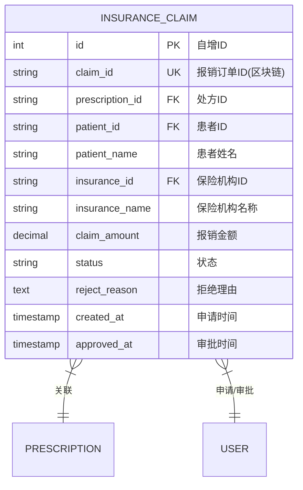

# 保险报销实体 ER 图

## 实体说明
保险报销实体处理患者基于处方的医疗费用报销业务，连接医疗服务和保险理赔。

## ER 图



## 实例数据

### 实例1: 待审核报销申请
```json
{
  "id": 1,
  "claim_id": "CLAIM-2024-0001",
  "prescription_id": "PRESC-2024-0001-XH",
  "patient_id": "2",
  "patient_name": "李明",
  "insurance_id": "4",
  "insurance_name": "平安保险",
  "claim_amount": 856.50,
  "status": "pending",
  "reject_reason": null,
  "created_at": "2024-02-15 15:00:00",
  "approved_at": null
}
```

### 实例2: 已批准报销申请
```json
{
  "id": 2,
  "claim_id": "CLAIM-2024-0002",
  "prescription_id": "PRESC-2024-0002-301",
  "patient_id": "6",
  "patient_name": "王芳",
  "insurance_id": "4",
  "insurance_name": "平安保险",
  "claim_amount": 432.80,
  "status": "approved",
  "reject_reason": null,
  "created_at": "2024-02-20 17:00:00",
  "approved_at": "2024-02-21 10:30:00"
}
```

### 实例3: 已拒绝报销申请
```json
{
  "id": 3,
  "claim_id": "CLAIM-2024-0003",
  "prescription_id": "PRESC-2024-0003-WJ",
  "patient_id": "8",
  "patient_name": "赵强",
  "insurance_id": "15",
  "insurance_name": "人寿保险",
  "claim_amount": 1250.00,
  "status": "rejected",
  "reject_reason": "该患者的保险计划不包含糖尿病药品报销项目。根据保险合同条款第3.2款，慢性病用药需要购买附加险才能报销。",
  "created_at": "2024-02-25 11:00:00",
  "approved_at": "2024-02-26 14:00:00"
}
```

### 实例4: 部分报销申请（已批准）
```json
{
  "id": 4,
  "claim_id": "CLAIM-2024-0004",
  "prescription_id": "PRESC-2024-0001-XH",
  "patient_id": "2",
  "patient_name": "李明",
  "insurance_id": "4",
  "insurance_name": "平安保险",
  "claim_amount": 600.00,
  "status": "approved",
  "reject_reason": null,
  "created_at": "2024-02-22 16:30:00",
  "approved_at": "2024-02-23 09:15:00"
}
```

### 实例5: 高额报销申请（待审核）
```json
{
  "id": 5,
  "claim_id": "CLAIM-2024-0005-HIGH",
  "prescription_id": "PRESC-2024-0010-XH",
  "patient_id": "16",
  "patient_name": "陈静",
  "insurance_id": "4",
  "insurance_name": "平安保险",
  "claim_amount": 15680.00,
  "status": "pending",
  "reject_reason": null,
  "created_at": "2024-03-01 10:00:00",
  "approved_at": null
}
```

## 属性说明

| 属性名 | 类型 | 约束 | 说明 |
|--------|------|------|------|
| id | INT | PK, AUTO_INCREMENT | 数据库自增ID |
| claim_id | VARCHAR(100) | UNIQUE, NOT NULL | 区块链报销订单ID |
| prescription_id | VARCHAR(100) | NOT NULL, FK | 处方ID，关联病历表 |
| patient_id | VARCHAR(100) | NOT NULL, FK | 患者ID，关联用户表 |
| patient_name | VARCHAR(100) | NOT NULL | 患者姓名 |
| insurance_id | VARCHAR(100) | NOT NULL, FK | 保险机构ID，关联用户表 |
| insurance_name | VARCHAR(200) | NOT NULL | 保险机构名称 |
| claim_amount | DECIMAL(10,2) | NOT NULL | 报销金额（元） |
| status | VARCHAR(20) | NOT NULL, DEFAULT 'pending' | 状态 |
| reject_reason | TEXT | | 拒绝理由（仅在拒绝时填写） |
| created_at | TIMESTAMP | DEFAULT CURRENT_TIMESTAMP | 申请时间 |
| approved_at | TIMESTAMP | NULL | 审批时间 |

## 状态说明

| 状态值 | 说明 | 后续操作 |
|--------|------|----------|
| pending | 待审核 | 保险机构审批 |
| approved | 已批准 | 理赔打款 |
| rejected | 已拒绝 | 无（终态） |

## 业务规则

1. **处方依据**: 
   - 报销申请必须基于有效的处方
   - 处方必须包含完整的诊疗信息
2. **金额计算**: 
   - 报销金额根据保险政策计算
   - 不同险种报销比例不同
   - 可能有起付线和封顶线限制
3. **审核流程**: 
   - 保险机构审核处方真实性
   - 验证患者保险资格
   - 核对报销金额计算
4. **状态流转**: 
   ```
   pending → approved（批准）
   pending → rejected（拒绝）
   ```
5. **拒绝原因**: 
   - 保险机构拒绝时必须填写拒绝理由
   - 常见原因：不在保险范围、超出限额、资料不全等
6. **时效性**: 
   - 报销申请有时效限制（如30天内）
   - 超期申请可能被拒绝

## 报销流程

```
1. 患者就医获得处方
   ↓
2. 患者提交报销申请（status=pending）
   ↓
3. 保险机构审核
   ├─ 审核通过 → approved → 理赔打款
   └─ 审核不通过 → rejected → 通知患者
```

## 报销金额计算规则

### 基本公式
```
报销金额 = (医疗费用 - 起付线) × 报销比例
```

### 示例计算
```
医疗费用：1000元
起付线：100元
报销比例：80%
报销金额 = (1000 - 100) × 80% = 720元
```

### 特殊情况
1. **低于起付线**: 不予报销
2. **超过封顶线**: 按封顶线计算
3. **自费项目**: 不纳入报销范围
4. **部分报销**: 某些药品按特定比例报销

## 索引设计

- PRIMARY KEY: `id`
- UNIQUE KEY: `claim_id`
- INDEX: `patient_id`, `prescription_id`, `insurance_id`, `status`, `created_at`

## 区块链特性

- **不可篡改**: 报销申请和审批结果记录在区块链上
- **可追溯**: 可以追溯报销申请的完整历史
- **透明性**: 患者、保险机构、监管部门都可以查看
- **防欺诈**: 区块链确保处方和报销数据的真实性

## 统计分析

### 1. 患者报销统计
```sql
-- 患者报销总额
SELECT patient_id, patient_name,
       COUNT(*) AS claim_count,
       SUM(CASE WHEN status='approved' THEN claim_amount ELSE 0 END) AS total_approved,
       SUM(CASE WHEN status='rejected' THEN claim_amount ELSE 0 END) AS total_rejected
FROM insurance_claims
WHERE patient_id = '2'
GROUP BY patient_id, patient_name;
```

### 2. 保险机构统计
```sql
-- 保险机构理赔统计
SELECT insurance_id, insurance_name,
       COUNT(*) AS total_claims,
       SUM(CASE WHEN status='approved' THEN 1 ELSE 0 END) AS approved_count,
       SUM(CASE WHEN status='rejected' THEN 1 ELSE 0 END) AS rejected_count,
       SUM(CASE WHEN status='approved' THEN claim_amount ELSE 0 END) AS total_payout,
       ROUND(SUM(CASE WHEN status='approved' THEN 1 ELSE 0 END) * 100.0 / COUNT(*), 2) AS approval_rate
FROM insurance_claims
GROUP BY insurance_id, insurance_name;
```

### 3. 月度报销趋势
```sql
-- 月度报销趋势
SELECT DATE_FORMAT(created_at, '%Y-%m') AS month,
       COUNT(*) AS claim_count,
       SUM(CASE WHEN status='approved' THEN claim_amount ELSE 0 END) AS total_amount
FROM insurance_claims
GROUP BY DATE_FORMAT(created_at, '%Y-%m')
ORDER BY month DESC;
```

## 与其他实体的关系

```
患者 (1) ----申请----> (N) 保险报销
保险机构 (1) ----审批----> (N) 保险报销
处方 (1) ----关联----> (N) 保险报销

一个患者可以提交多个报销申请
一个保险机构可以审批多个报销申请
一个处方可以关联多个报销申请（不同保险）
```

## 典型场景

### 场景1: 门诊报销
患者门诊就医后，提交处方申请医保报销。

### 场景2: 住院报销
患者出院后，提交住院费用报销申请。

### 场景3: 商业保险报销
患者使用商业保险进行补充报销。

### 场景4: 跨地区报销
患者异地就医，申请跨地区医保报销。

## 安全与合规

1. **身份验证**: 
   - 验证患者保险资格
   - 确认保险有效期
2. **处方验证**: 
   - 验证处方真实性
   - 防止伪造处方骗保
3. **金额审核**: 
   - 核对费用明细
   - 防止虚报金额
4. **审计追踪**: 
   - 所有报销操作记录在审计日志中
   - 监管部门可以查看报销历史
5. **反欺诈**: 
   - 检测异常报销行为
   - 识别重复报销

## 常见拒绝原因

1. **不在保险范围**: 
   - 药品不在医保目录
   - 诊疗项目不在报销范围
2. **超出限额**: 
   - 超过年度报销限额
   - 超过单次报销限额
3. **资料不全**: 
   - 缺少必要的诊疗信息
   - 处方信息不完整
4. **保险失效**: 
   - 保险已过期
   - 保险已停保
5. **重复报销**: 
   - 该处方已报销过
   - 重复提交申请

## 未来扩展

1. **自动审核**: 基于规则引擎的自动审核系统
2. **智能推荐**: 推荐最优报销方案
3. **电子理赔**: 实时在线理赔
4. **多险种支持**: 支持医保、商保组合报销
5. **移动端支持**: 手机APP快速报销
6. **AI辅助**: 智能识别处方和费用明细
