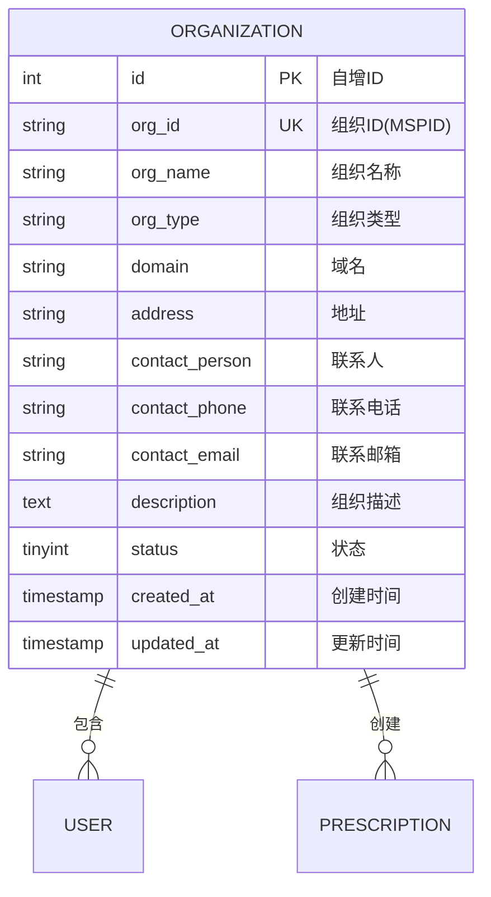

# 组织机构实体 ER 图

## 实体说明
组织机构实体管理区块链联盟中的各个组织，包括医院、药店、保险机构和监管中心。

## ER 图



## 实例数据

### 实例1: 三甲医院
```json
{
  "id": 1,
  "org_id": "TaobaoMSP",
  "org_name": "协和医院",
  "org_type": "医院",
  "domain": "taobao.com",
  "address": "北京市东城区帅府园1号",
  "contact_person": "张主任",
  "contact_phone": "010-69156114",
  "contact_email": "contact@xiehe.com",
  "description": "北京协和医院是一所集医疗、教学、科研于一体的现代化综合三甲医院，是国家卫生健康委指定的全国疑难重症诊治指导中心。",
  "status": 1,
  "created_at": "2024-01-01 00:00:00",
  "updated_at": "2024-01-01 00:00:00"
}
```

### 实例2: 军队医院
```json
{
  "id": 2,
  "org_id": "JDMSP",
  "org_name": "301医院",
  "org_type": "医院",
  "domain": "jd.com",
  "address": "北京市海淀区复兴路28号",
  "contact_person": "李主任",
  "contact_phone": "010-66887329",
  "contact_email": "info@301hospital.com",
  "description": "中国人民解放军总医院（301医院）是集医疗、保健、教学、科研于一体的大型现代化综合性医院，是全军规模最大的综合性医院。",
  "status": 1,
  "created_at": "2024-01-01 00:00:00",
  "updated_at": "2024-01-01 00:00:00"
}
```

### 实例3: 社区医疗中心
```json
{
  "id": 3,
  "org_id": "WenjinMSP",
  "org_name": "温江社区医疗中心",
  "org_type": "医院",
  "domain": "wenjin.com",
  "address": "四川省成都市温江区柳城大道东段88号",
  "contact_person": "王主任",
  "contact_phone": "028-82722120",
  "contact_email": "service@wenjin-health.com",
  "description": "成都市温江区社区医疗服务中心，为社区居民提供基本医疗、公共卫生、健康管理等综合服务。",
  "status": 1,
  "created_at": "2024-01-01 00:00:00",
  "updated_at": "2024-01-01 00:00:00"
}
```

### 实例4: 监管中心
```json
{
  "id": 4,
  "org_id": "RegCenterMSP",
  "org_name": "医疗数据监管中心",
  "org_type": "监管中心",
  "domain": "regcenter.com",
  "address": "北京市西城区西直门外大街1号",
  "contact_person": "赵处长",
  "contact_phone": "010-68792114",
  "contact_email": "supervision@regcenter.gov.cn",
  "description": "国家医疗数据监管中心，负责医疗数据的监督管理、质量控制和安全审计。",
  "status": 1,
  "created_at": "2024-01-01 00:00:00",
  "updated_at": "2024-01-01 00:00:00"
}
```

### 实例5: 连锁药店
```json
{
  "id": 5,
  "org_id": "RenheMSP",
  "org_name": "仁和药店连锁",
  "org_type": "药店",
  "domain": "renhe-pharmacy.com",
  "address": "北京市朝阳区建国路88号",
  "contact_person": "孙经理",
  "contact_phone": "010-85886688",
  "contact_email": "business@renhe-pharmacy.com",
  "description": "仁和药店是一家全国性连锁药店，拥有500多家门店，提供处方药、非处方药、保健品等产品销售和药学服务。",
  "status": 1,
  "created_at": "2024-01-05 00:00:00",
  "updated_at": "2024-01-05 00:00:00"
}
```

### 实例6: 保险公司
```json
{
  "id": 6,
  "org_id": "PinganMSP",
  "org_name": "平安健康保险",
  "org_type": "保险机构",
  "domain": "pingan.com",
  "address": "上海市浦东新区陆家嘴环路1333号",
  "contact_person": "钱总监",
  "contact_phone": "400-800-8000",
  "contact_email": "health@pingan.com",
  "description": "平安健康保险股份有限公司，专业从事健康保险业务，提供医疗保险、重疾险、意外险等多种保险产品。",
  "status": 1,
  "created_at": "2024-01-05 00:00:00",
  "updated_at": "2024-01-05 00:00:00"
}
```

### 实例7: 已禁用组织
```json
{
  "id": 7,
  "org_id": "OldHospitalMSP",
  "org_name": "旧城医院",
  "org_type": "医院",
  "domain": "oldhospital.com",
  "address": "北京市某区某街道",
  "contact_person": "已注销",
  "contact_phone": "已停用",
  "contact_email": "disabled@example.com",
  "description": "该医院已关闭，组织已禁用。",
  "status": 0,
  "created_at": "2023-01-01 00:00:00",
  "updated_at": "2024-02-01 00:00:00"
}
```

## 属性说明

| 属性名 | 类型 | 约束 | 说明 |
|--------|------|------|------|
| id | INT | PK, AUTO_INCREMENT | 数据库自增ID |
| org_id | VARCHAR(100) | UNIQUE, NOT NULL | 组织ID（MSPID），区块链组织标识 |
| org_name | VARCHAR(200) | NOT NULL | 组织名称 |
| org_type | VARCHAR(50) | NOT NULL | 组织类型 |
| domain | VARCHAR(100) | | 域名 |
| address | VARCHAR(500) | | 地址 |
| contact_person | VARCHAR(100) | | 联系人 |
| contact_phone | VARCHAR(20) | | 联系电话 |
| contact_email | VARCHAR(100) | | 联系邮箱 |
| description | TEXT | | 组织描述 |
| status | TINYINT | DEFAULT 1 | 状态：1-正常，0-禁用 |
| created_at | TIMESTAMP | DEFAULT CURRENT_TIMESTAMP | 创建时间 |
| updated_at | TIMESTAMP | ON UPDATE CURRENT_TIMESTAMP | 更新时间 |

## 组织类型说明

| 类型 | 说明 | 主要职责 |
|------|------|----------|
| 医院 | 医疗机构 | 提供医疗服务、创建病历、开具处方 |
| 药店 | 药品零售机构 | 销售药品、处理药品订单 |
| 保险机构 | 保险公司 | 审批保险报销、理赔服务 |
| 监管中心 | 政府监管部门 | 监督管理、数据审计、质量控制 |

## 业务规则

1. **MSPID唯一性**: 
   - org_id（MSPID）在区块链网络中全局唯一
   - 对应Hyperledger Fabric的组织标识
2. **组织类型**: 
   - 必须是预定义的类型之一
   - 不同类型组织有不同的权限和职责
3. **状态管理**: 
   - status=1：正常运营
   - status=0：已禁用（不能创建新数据）
4. **联系信息**: 
   - 联系人、电话、邮箱用于组织间沟通
   - 监管部门可以通过联系方式进行监督
5. **域名**: 
   - 用于区块链网络配置
   - 对应Fabric网络中的域名

## 区块链组织架构

```
联盟链网络
├── TaobaoMSP (协和医院)
│   ├── Peer节点
│   ├── CA证书颁发机构
│   └── 用户身份
├── JDMSP (301医院)
│   ├── Peer节点
│   ├── CA证书颁发机构
│   └── 用户身份
├── WenjinMSP (温江社区医疗中心)
│   ├── Peer节点
│   ├── CA证书颁发机构
│   └── 用户身份
└── RegCenterMSP (监管中心)
    ├── Peer节点
    ├── CA证书颁发机构
    └── 用户身份
```

## 索引设计

- PRIMARY KEY: `id`
- UNIQUE KEY: `org_id`
- INDEX: `org_type`, `status`

## 组织权限

### 医院组织
- 创建和查看本组织的病历
- 添加补充记录
- 申请跨组织访问授权
- 查看已授权的其他组织病历

### 药店组织
- 查看处方信息（需授权）
- 处理药品订单
- 查看订单历史

### 保险机构组织
- 查看报销相关的处方信息
- 审批保险报销申请
- 查看理赔历史

### 监管中心组织
- 查看所有组织的数据（只读）
- 审计操作日志
- 监督数据质量
- 生成监管报告

## 统计分析

### 1. 组织统计
```sql
-- 按类型统计组织数量
SELECT org_type, 
       COUNT(*) AS total_count,
       SUM(CASE WHEN status=1 THEN 1 ELSE 0 END) AS active_count
FROM organizations
GROUP BY org_type;
```

### 2. 医院业务量统计
```sql
-- 医院病历创建量统计
SELECT o.org_id, o.org_name,
       COUNT(p.id) AS prescription_count
FROM organizations o
LEFT JOIN prescriptions p ON o.org_id = p.organization_id
WHERE o.org_type = '医院' AND o.status = 1
GROUP BY o.org_id, o.org_name
ORDER BY prescription_count DESC;
```

### 3. 药店订单统计
```sql
-- 药店订单处理量统计
SELECT u.organization AS org_id, u.organization_name,
       COUNT(d.id) AS order_count,
       SUM(d.quantity * d.price) AS total_sales
FROM users u
JOIN drug_orders d ON u.id = d.drug_store_id
WHERE u.role = '药店' AND u.status = 1
GROUP BY u.organization, u.organization_name
ORDER BY total_sales DESC;
```

## 与其他实体的关系

```
组织 (1) ----包含----> (N) 用户
组织 (1) ----创建----> (N) 病历
组织 (1) ----处理----> (N) 药品订单
组织 (1) ----审批----> (N) 保险报销

一个组织可以有多个用户
一个组织可以创建多个病历
一个组织可以处理多个订单
一个组织可以审批多个报销
```

## 典型场景

### 场景1: 新医院加入联盟
新医院申请加入区块链联盟，创建组织记录，配置区块链节点。

### 场景2: 跨组织协作
不同医院之间通过授权机制共享患者病历数据。

### 场景3: 监管审计
监管中心查看所有组织的数据，进行质量审计和合规检查。

### 场景4: 组织禁用
某组织因违规被禁用，不能再创建新的业务数据。

## 安全与合规

1. **身份认证**: 
   - 每个组织有独立的CA证书颁发机构
   - 组织内用户身份由组织CA签发
2. **权限隔离**: 
   - 不同组织的数据默认隔离
   - 跨组织访问需要授权
3. **审计追踪**: 
   - 所有组织操作记录在审计日志中
   - 监管中心可以查看所有操作
4. **数据主权**: 
   - 每个组织拥有自己的数据主权
   - 数据共享需要明确授权

## 区块链配置

### Fabric网络配置示例
```yaml
organizations:
  - &TaobaoMSP
    Name: TaobaoMSP
    ID: TaobaoMSP
    MSPDir: crypto-config/peerOrganizations/taobao.com/msp
    Policies:
      Readers:
        Type: Signature
        Rule: "OR('TaobaoMSP.member')"
      Writers:
        Type: Signature
        Rule: "OR('TaobaoMSP.member')"
      Admins:
        Type: Signature
        Rule: "OR('TaobaoMSP.admin')"
```

## 未来扩展

1. **动态加入**: 支持组织动态加入和退出联盟
2. **分级管理**: 支持组织层级结构（总院-分院）
3. **跨链互通**: 支持与其他区块链网络互通
4. **智能合约**: 基于组织的智能合约权限管理
5. **性能监控**: 监控各组织节点的性能指标
6. **自动化运维**: 自动化的组织配置和部署
