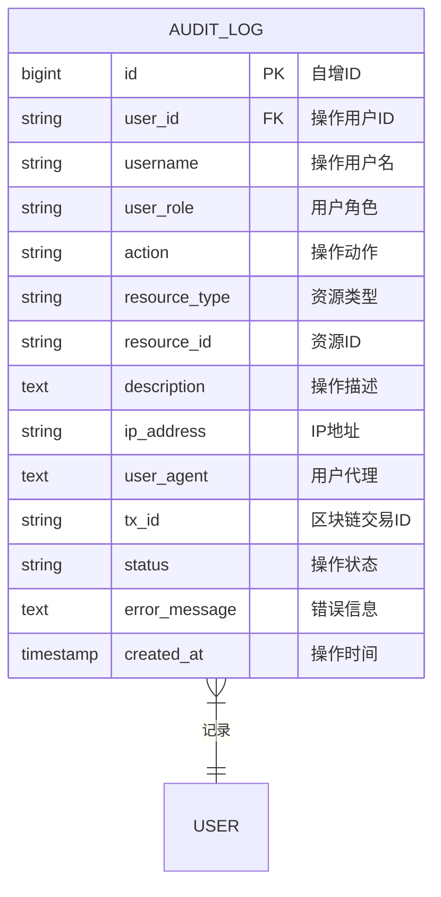

# 审计日志实体 ER 图

## 实体说明
审计日志实体记录系统中所有用户的操作行为，用于安全审计、问题追踪和合规监管。

## ER 图



## 实例数据

### 实例1: 用户登录日志
```json
{
  "id": 1,
  "user_id": "1",
  "username": "doctor_zhang",
  "user_role": "医生",
  "action": "user.login",
  "resource_type": "user",
  "resource_id": "1",
  "description": "用户登录系统",
  "ip_address": "192.168.1.100",
  "user_agent": "Mozilla/5.0 (Windows NT 10.0; Win64; x64) AppleWebKit/537.36",
  "tx_id": null,
  "status": "success",
  "error_message": null,
  "created_at": "2024-02-15 08:30:00"
}
```

### 实例2: 创建病历日志
```json
{
  "id": 2,
  "user_id": "1",
  "username": "doctor_zhang",
  "user_role": "医生",
  "action": "prescription.create",
  "resource_type": "prescription",
  "resource_id": "PRESC-2024-0001-XH",
  "description": "创建病历：患者李明，诊断为冠心病",
  "ip_address": "192.168.1.100",
  "user_agent": "Mozilla/5.0 (Windows NT 10.0; Win64; x64) AppleWebKit/537.36",
  "tx_id": "a1b2c3d4e5f6g7h8i9j0k1l2m3n4o5p6",
  "status": "success",
  "error_message": null,
  "created_at": "2024-02-15 10:30:00"
}
```

### 实例3: 授权请求日志
```json
{
  "id": 3,
  "user_id": "7",
  "username": "doctor_li",
  "user_role": "医生",
  "action": "access_request.create",
  "resource_type": "access_request",
  "resource_id": "ACCESS-2024-0001",
  "description": "申请访问病历：PRESC-2024-0001-XH，理由：患者转诊需要查看病史",
  "ip_address": "192.168.2.50",
  "user_agent": "Mozilla/5.0 (Macintosh; Intel Mac OS X 10_15_7) AppleWebKit/537.36",
  "tx_id": null,
  "status": "success",
  "error_message": null,
  "created_at": "2024-02-28 08:30:00"
}
```

### 实例4: 授权审批日志
```json
{
  "id": 4,
  "user_id": "2",
  "username": "patient_li",
  "user_role": "病人",
  "action": "access_request.approve",
  "resource_type": "access_request",
  "resource_id": "ACCESS-2024-0001",
  "description": "批准授权请求：允许301医院李医生查看病历",
  "ip_address": "10.0.0.25",
  "user_agent": "Mozilla/5.0 (iPhone; CPU iPhone OS 16_0 like Mac OS X) AppleWebKit/605.1.15",
  "tx_id": null,
  "status": "success",
  "error_message": null,
  "created_at": "2024-02-28 14:30:00"
}
```

### 实例5: 查看病历日志
```json
{
  "id": 5,
  "user_id": "7",
  "username": "doctor_li",
  "user_role": "医生",
  "action": "prescription.view",
  "resource_type": "prescription",
  "resource_id": "PRESC-2024-0001-XH",
  "description": "查看病历：PRESC-2024-0001-XH",
  "ip_address": "192.168.2.50",
  "user_agent": "Mozilla/5.0 (Macintosh; Intel Mac OS X 10_15_7) AppleWebKit/537.36",
  "tx_id": null,
  "status": "success",
  "error_message": null,
  "created_at": "2024-02-28 14:35:00"
}
```

### 实例6: 添加补充记录日志
```json
{
  "id": 6,
  "user_id": "1",
  "username": "doctor_zhang",
  "user_role": "医生",
  "action": "supplement_record.create",
  "resource_type": "supplement_record",
  "resource_id": "SUPP-2024-0001-XH",
  "description": "添加补充记录：复诊记录，患者症状好转",
  "ip_address": "192.168.1.100",
  "user_agent": "Mozilla/5.0 (Windows NT 10.0; Win64; x64) AppleWebKit/537.36",
  "tx_id": "d4e5f6g7h8i9j0k1l2m3n4o5p6q7r8s9",
  "status": "success",
  "error_message": null,
  "created_at": "2024-02-22 14:30:00"
}
```

### 实例7: 下单日志
```json
{
  "id": 7,
  "user_id": "2",
  "username": "patient_li",
  "user_role": "病人",
  "action": "drug_order.create",
  "resource_type": "drug_order",
  "resource_id": "ORDER-2024-0001",
  "description": "创建药品订单：阿司匹林肠溶片 30片",
  "ip_address": "10.0.0.25",
  "user_agent": "Mozilla/5.0 (iPhone; CPU iPhone OS 16_0 like Mac OS X) AppleWebKit/605.1.15",
  "tx_id": null,
  "status": "success",
  "error_message": null,
  "created_at": "2024-02-15 11:00:00"
}
```

### 实例8: 订单处理日志
```json
{
  "id": 8,
  "user_id": "3",
  "username": "pharmacy_renhe",
  "user_role": "药店",
  "action": "drug_order.process",
  "resource_type": "drug_order",
  "resource_id": "ORDER-2024-0001",
  "description": "处理药品订单：订单状态更新为处理中",
  "ip_address": "192.168.3.10",
  "user_agent": "Mozilla/5.0 (Windows NT 10.0; Win64; x64) AppleWebKit/537.36",
  "tx_id": null,
  "status": "success",
  "error_message": null,
  "created_at": "2024-02-15 11:30:00"
}
```

### 实例9: 保险报销申请日志
```json
{
  "id": 9,
  "user_id": "2",
  "username": "patient_li",
  "user_role": "病人",
  "action": "insurance_claim.create",
  "resource_type": "insurance_claim",
  "resource_id": "CLAIM-2024-0001",
  "description": "提交保险报销申请：报销金额856.50元",
  "ip_address": "10.0.0.25",
  "user_agent": "Mozilla/5.0 (iPhone; CPU iPhone OS 16_0 like Mac OS X) AppleWebKit/605.1.15",
  "tx_id": null,
  "status": "success",
  "error_message": null,
  "created_at": "2024-02-15 15:00:00"
}
```

### 实例10: 操作失败日志
```json
{
  "id": 10,
  "user_id": "7",
  "username": "doctor_li",
  "user_role": "医生",
  "action": "prescription.view",
  "resource_type": "prescription",
  "resource_id": "PRESC-2024-0001-XH",
  "description": "尝试查看病历：PRESC-2024-0001-XH",
  "ip_address": "192.168.2.50",
  "user_agent": "Mozilla/5.0 (Macintosh; Intel Mac OS X 10_15_7) AppleWebKit/537.36",
  "tx_id": null,
  "status": "failed",
  "error_message": "权限不足：未获得患者授权，无法查看该病历",
  "created_at": "2024-02-27 10:00:00"
}
```

## 属性说明

| 属性名 | 类型 | 约束 | 说明 |
|--------|------|------|------|
| id | BIGINT | PK, AUTO_INCREMENT | 日志唯一标识 |
| user_id | VARCHAR(100) | NOT NULL, FK | 操作用户ID |
| username | VARCHAR(255) | NOT NULL | 操作用户名 |
| user_role | VARCHAR(50) | NOT NULL | 用户角色 |
| action | VARCHAR(100) | NOT NULL | 操作动作 |
| resource_type | VARCHAR(50) | NOT NULL | 资源类型 |
| resource_id | VARCHAR(100) | | 资源ID |
| description | TEXT | | 操作描述 |
| ip_address | VARCHAR(50) | | IP地址 |
| user_agent | TEXT | | 用户代理（浏览器信息） |
| tx_id | VARCHAR(100) | | 区块链交易ID |
| status | VARCHAR(20) | DEFAULT 'success' | 操作状态 |
| error_message | TEXT | | 错误信息 |
| created_at | TIMESTAMP | DEFAULT CURRENT_TIMESTAMP | 操作时间 |

## 操作动作分类

### 用户操作
- `user.login` - 用户登录
- `user.logout` - 用户登出
- `user.create` - 创建用户
- `user.update` - 更新用户信息
- `user.delete` - 删除用户
- `user.disable` - 禁用用户
- `user.enable` - 启用用户

### 病历操作
- `prescription.create` - 创建病历
- `prescription.view` - 查看病历
- `prescription.update` - 更新病历
- `prescription.delete` - 删除病历
- `prescription.search` - 搜索病历

### 补充记录操作
- `supplement_record.create` - 添加补充记录
- `supplement_record.view` - 查看补充记录

### 授权请求操作
- `access_request.create` - 创建授权请求
- `access_request.approve` - 批准授权请求
- `access_request.reject` - 拒绝授权请求
- `access_request.view` - 查看授权请求

### 药品订单操作
- `drug_order.create` - 创建药品订单
- `drug_order.process` - 处理药品订单
- `drug_order.complete` - 完成药品订单
- `drug_order.cancel` - 取消药品订单

### 保险报销操作
- `insurance_claim.create` - 创建报销申请
- `insurance_claim.approve` - 批准报销申请
- `insurance_claim.reject` - 拒绝报销申请

## 资源类型

| 资源类型 | 说明 |
|---------|------|
| user | 用户 |
| prescription | 病历 |
| supplement_record | 补充记录 |
| access_request | 授权请求 |
| drug_order | 药品订单 |
| insurance_claim | 保险报销 |
| organization | 组织机构 |
| system | 系统配置 |

## 操作状态

| 状态值 | 说明 |
|--------|------|
| success | 操作成功 |
| failed | 操作失败 |

## 业务规则

1. **完整记录**: 
   - 所有用户操作都必须记录
   - 包括成功和失败的操作
2. **不可修改**: 
   - 审计日志一旦创建，不可修改或删除
   - 确保审计追踪的完整性
3. **详细信息**: 
   - 记录操作的详细上下文信息
   - 包括IP地址、用户代理等
4. **区块链关联**: 
   - 涉及区块链的操作记录交易ID
   - 便于追溯区块链交易
5. **错误记录**: 
   - 失败操作必须记录错误信息
   - 便于问题排查和安全分析

## 索引设计

- PRIMARY KEY: `id`
- INDEX: `user_id`, `action`, `resource_type`, `resource_id`, `created_at`, `status`

## 审计分析

### 1. 用户操作统计
```sql
-- 用户操作次数统计
SELECT user_id, username, user_role,
       COUNT(*) AS total_operations,
       SUM(CASE WHEN status='success' THEN 1 ELSE 0 END) AS success_count,
       SUM(CASE WHEN status='failed' THEN 1 ELSE 0 END) AS failed_count
FROM audit_logs
WHERE created_at >= DATE_SUB(NOW(), INTERVAL 30 DAY)
GROUP BY user_id, username, user_role
ORDER BY total_operations DESC;
```

### 2. 操作类型分布
```sql
-- 操作类型分布统计
SELECT action,
       COUNT(*) AS operation_count,
       ROUND(COUNT(*) * 100.0 / (SELECT COUNT(*) FROM audit_logs), 2) AS percentage
FROM audit_logs
WHERE created_at >= DATE_SUB(NOW(), INTERVAL 7 DAY)
GROUP BY action
ORDER BY operation_count DESC;
```

### 3. 失败操作分析
```sql
-- 失败操作分析
SELECT user_id, username, action, resource_type,
       COUNT(*) AS failed_count,
       error_message
FROM audit_logs
WHERE status = 'failed'
  AND created_at >= DATE_SUB(NOW(), INTERVAL 7 DAY)
GROUP BY user_id, username, action, resource_type, error_message
ORDER BY failed_count DESC;
```

### 4. 异常IP检测
```sql
-- 异常IP访问检测
SELECT ip_address,
       COUNT(DISTINCT user_id) AS user_count,
       COUNT(*) AS operation_count
FROM audit_logs
WHERE created_at >= DATE_SUB(NOW(), INTERVAL 1 DAY)
GROUP BY ip_address
HAVING user_count > 5 OR operation_count > 100
ORDER BY operation_count DESC;
```

### 5. 病历访问追踪
```sql
-- 特定病历的访问历史
SELECT al.created_at, al.user_id, al.username, al.user_role,
       al.action, al.ip_address, al.status
FROM audit_logs al
WHERE al.resource_type = 'prescription'
  AND al.resource_id = 'PRESC-2024-0001-XH'
ORDER BY al.created_at DESC;
```

## 安全监控

### 1. 异常登录检测
- 短时间内多次登录失败
- 异常时间段登录（如凌晨）
- 异常地点登录（IP地址变化）

### 2. 权限滥用检测
- 频繁访问无关病历
- 批量下载数据
- 异常操作频率

### 3. 数据泄露风险
- 大量查看操作
- 跨组织频繁访问
- 敏感数据导出

## 合规要求

1. **数据保留**: 
   - 审计日志至少保留3年
   - 重要操作日志永久保留
2. **访问控制**: 
   - 只有管理员和监管部门可以查看审计日志
   - 普通用户只能查看自己的操作日志
3. **隐私保护**: 
   - 不记录敏感医疗数据内容
   - 只记录操作行为和元数据
4. **完整性**: 
   - 审计日志不可篡改
   - 定期备份审计日志

## 典型场景

### 场景1: 安全审计
监管部门定期审查系统操作日志，检查是否存在违规操作。

### 场景2: 问题排查
系统出现问题时，通过审计日志追踪问题原因。

### 场景3: 合规检查
医院内部审计，检查医生是否规范操作。

### 场景4: 纠纷处理
患者投诉时，通过审计日志还原操作过程。

## 与其他实体的关系

```
用户 (1) ----产生----> (N) 审计日志

一个用户可以产生多个审计日志
每个审计日志记录一个用户的一次操作
```

## 未来扩展

1. **实时监控**: 实时监控异常操作，及时告警
2. **智能分析**: 基于AI的异常行为检测
3. **可视化**: 审计日志的可视化展示和分析
4. **自动响应**: 检测到异常操作自动采取措施
5. **日志聚合**: 多系统日志聚合分析
6. **合规报告**: 自动生成合规审计报告
