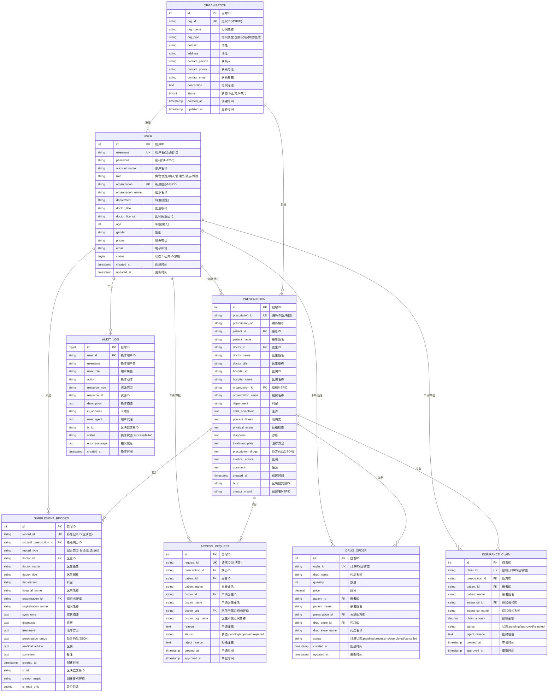

# 基于区块链的医疗信息管理系统 - 完整项目ER图

## 项目概述

这是一个基于Hyperledger Fabric区块链的社区医疗管理信息系统，实现了跨组织的医疗数据共享、隐私保护和授权管理。

## 核心实体关系图 (Mermaid格式)



## 系统架构层次

### 1. 用户层 (User Layer)
- **医生 (Doctor)**: 创建病历、添加补充记录、申请跨组织授权
- **患者 (Patient)**: 拥有病历、审批授权请求、下药品订单、申请保险报销
- **药店 (Pharmacy)**: 处理药品订单
- **保险机构 (Insurance)**: 审批保险报销
- **管理员 (Admin)**: 系统管理、用户管理、审计监控

### 2. 业务层 (Business Layer)
- **病历管理**: 创建、查询、更新病历信息
- **补充记录**: 复诊、随访、急诊记录
- **授权管理**: 跨组织访问授权申请与审批
- **药品订单**: 基于处方的药品购买
- **保险报销**: 基于处方的保险理赔

### 3. 区块链层 (Blockchain Layer)
- **Hyperledger Fabric**: 联盟链底层
- **智能合约 (Chaincode)**: 业务逻辑执行
- **通道 (Channel)**: appchannel
- **组织 (Organizations)**: 
  - TaobaoMSP (协和医院)
  - JDMSP (301医院)
  - WenjinMSP (温江社区医疗中心)
  - RegCenterMSP (监管中心)

### 4. 数据层 (Data Layer)
- **MySQL数据库**: 缓存区块链数据，提供快速查询
- **区块链账本**: 不可篡改的数据存储

## 核心业务流程

### 流程1: 病历创建与管理
```
医生登录 → 创建病历 → 写入区块链 → 缓存到MySQL → 患者可查看
```

### 流程2: 跨组织授权
```
外院医生申请授权 → 患者收到通知 → 患者审批 → 授权写入区块链 → 医生可访问病历
```

### 流程3: 补充记录
```
医生查看病历 → 添加补充记录 → 写入区块链 → 关联到原病历 → 更新病历历史
```

### 流程4: 药品订单
```
患者查看处方 → 选择药店下单 → 订单写入区块链 → 药店处理订单 → 订单完成
```

### 流程5: 保险报销
```
患者提交报销申请 → 保险机构审核 → 审批结果写入区块链 → 患者收到通知
```

## 数据完整性约束

### 实体完整性
- 所有表的主键不能为空且唯一
- 区块链ID (prescription_id, record_id等) 作为唯一键

### 参照完整性
- PRESCRIPTION.doctor_id → USER.id
- SUPPLEMENT_RECORD.original_prescription_id → PRESCRIPTION.prescription_id
- ACCESS_REQUEST.prescription_id → PRESCRIPTION.prescription_id
- DRUG_ORDER.prescription_id → PRESCRIPTION.prescription_id
- INSURANCE_CLAIM.prescription_id → PRESCRIPTION.prescription_id
- USER.organization → ORGANIZATION.org_id

### 用户定义完整性
- 角色字段: 医生/病人/管理员/药店/保险机构
- 状态字段: pending/approved/rejected/completed/cancelled
- 数量、价格必须大于0
- 时间戳字段不能为空

## 技术栈

### 后端
- **语言**: Go (Golang)
- **框架**: Gin Web Framework
- **数据库**: MySQL 8.0
- **区块链**: Hyperledger Fabric 2.x
- **SDK**: Fabric SDK Go

### 前端
- **框架**: Vue.js 3
- **UI库**: Element Plus
- **路由**: Vue Router
- **状态管理**: Pinia

### 区块链
- **平台**: Hyperledger Fabric
- **智能合约**: Go Chaincode
- **共识算法**: Raft
- **通道**: appchannel

## 安全特性

1. **身份认证**: 基于用户名密码的认证机制
2. **权限控制**: 基于角色的访问控制(RBAC)
3. **数据加密**: 密码SHA256哈希存储
4. **区块链不可篡改**: 所有关键操作写入区块链
5. **审计日志**: 完整的操作日志记录
6. **跨组织授权**: 患者控制的数据访问权限

## 系统特点

1. **去中心化**: 多组织联盟链架构
2. **数据隐私**: 患者数据加密存储，授权访问
3. **可追溯性**: 所有操作记录在区块链上
4. **跨组织协作**: 支持不同医疗机构间的数据共享
5. **高性能**: MySQL缓存提供快速查询
6. **可扩展**: 支持新组织加入联盟链

---

**生成时间**: 2026-04-03  
**系统版本**: v1.0  
**文档作者**: Kiro AI Assistant
